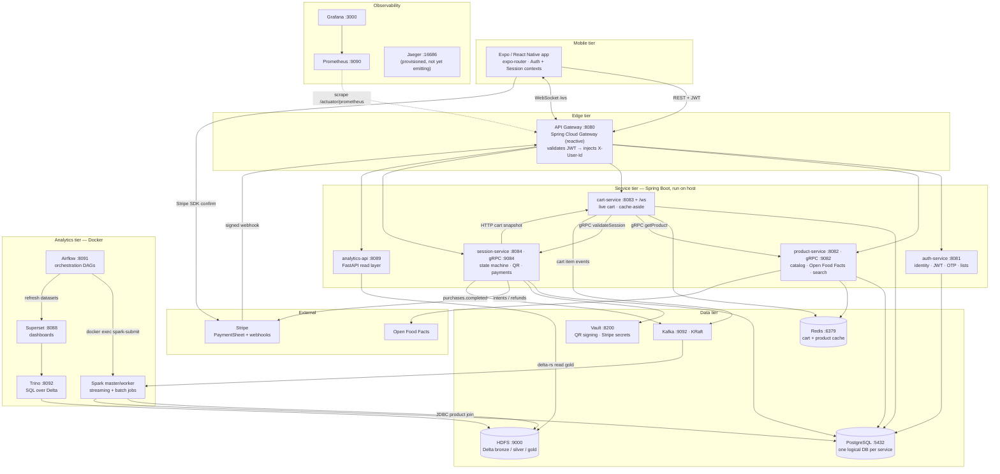
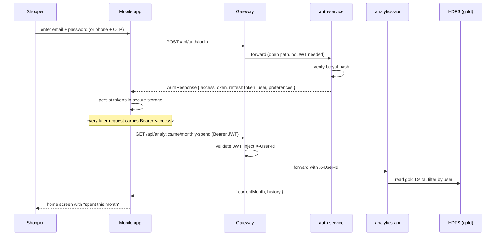
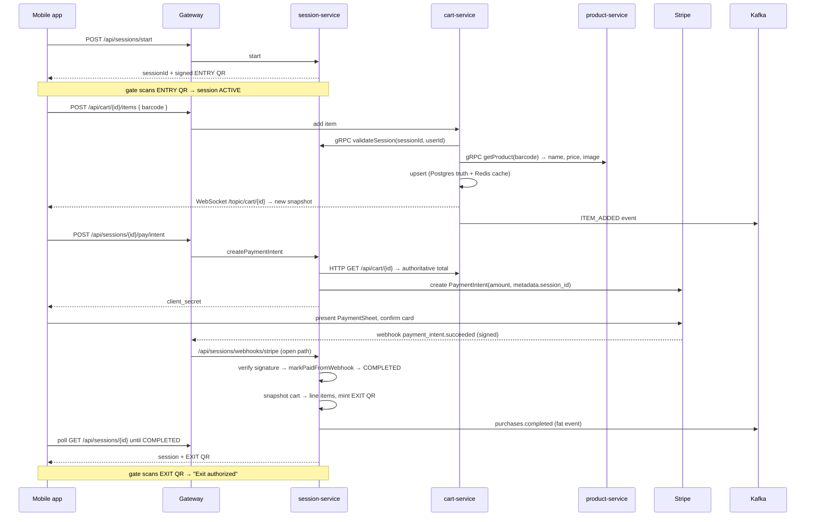
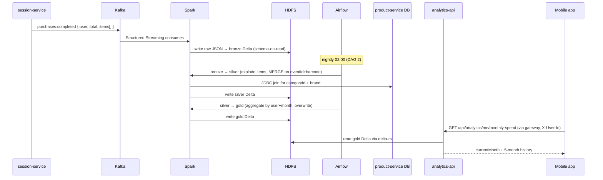

# AtlasSync — System Overview (00)

This is the master document for the AtlasSync deep-dive set. It frames the
whole system: what it does, the services it's made of, the three flows that
matter, and the decisions worth defending. Every later document (01–08) drills
into one slice; this one is the map you read first and come back to.

I wrote these for myself, to actually understand my own system before someone
asks me why I made each call. So the bias here is toward *why*, and toward the
places where the first obvious design didn't survive contact with reality.

---

## 1. What AtlasSync is

AtlasSync is a **phygital supermarket** app — the shopper is physically in a
real store, but the checkout is digital. You walk in, scan a QR at the gate to
open a *shopping session*, scan each item's barcode with your phone as you drop
it in your basket, and when you're done you pay in-app and walk out past an exit
gate that validates a signed QR. No till, no queue, no cashier. The problem
it's chewing on is the single worst part of the in-store experience — the
checkout line — without giving up the thing physical retail still wins at:
picking up the actual product, now, and leaving with it.

The interesting tension is that it's neither pure e-commerce nor a normal POS.
Online retail owns the catalog and the payment but never touches a physical
aisle; a supermarket till owns the physical checkout but knows nothing about
*you*. AtlasSync sits in the middle: it has to identify a real human (auth), let
them build a cart against a real catalog (product + cart), track a stateful
in-store visit that can be entered, paid, and exited (session), take money
safely without a card terminal (Stripe), and then — because every scan-walk-pay
trip is a clean structured event — turn that exhaust into analytics a shopper
and a store operator both care about (the Big Data pipeline). The "scan-walk-pay"
loop is the product; everything else exists to make that loop trustworthy.

---

## 2. The system at a glance

Five Spring Boot services (Java 21) run behind a single gateway, plus one Python
analytics service, plus a data/analytics stack that turns purchase events into a
lakehouse. The Spring services run on the **host** (in IntelliJ during dev);
everything else — databases, Kafka, Vault, the whole Big Data tier, and the
Python `analytics-api` — runs in Docker Compose. That host/container split is
deliberate and shows up later as a real source of bugs.

A few things to read off the diagram, because they're the load-bearing
decisions:

- **The gateway is the only door.** The mobile app never talks to a service
  directly; it talks to the gateway, which validates the JWT once and forwards a
  trusted `X-User-Id` header. Downstream services don't re-validate the token —
  they trust the header. That trust model is the spine of the auth story (and a
  footgun; see §5).
- **Three different transports on purpose.** Mobile→gateway is REST/JSON plus a
  WebSocket for live cart updates. Service→service is **gRPC** where it's on a
  latency-sensitive path (cart→product for price, cart→session for validation)
  and plain HTTP where it isn't (session→cart snapshot at checkout). Anything
  asynchronous and fan-out goes over **Kafka**.
- **The analytics tier is read-only downstream of a single Kafka event.** The
  whole lakehouse hangs off `purchases.completed`. Nothing in the transactional
  path waits on Spark, HDFS, or Trino.

---

## 3. Service catalog

Ports, persistence, and the one-line reason each thing exists. gRPC ports are
listed where a service runs a gRPC server in addition to its REST port.

### Application services

| Service | What it does | Port(s) | Persistence | Why this choice |
|---|---|---|---|---|
| **gateway** | Single entry point; validates the JWT and rewrites the request with `X-User-Id` / `X-User-Email` / `X-User-Role` / `X-Email-Verified` headers before routing. | 8080 | none | One place to terminate auth so five downstream services never each re-implement JWT parsing. Reactive (WebFlux) because it also proxies the cart WebSocket. |
| **auth-service** | Identity: register/login, JWT issue + refresh-token rotation, OTP (multi-channel), email verification, password reset, phone link — and it owns per-user **shopping lists**. | 8081 | Postgres `atlassync_auth` | Lists live here because they're per-user CRUD keyed on the same identity auth already owns (defended in 01). |
| **product-service** | Barcode lookup, Open Food Facts enrichment + boot-time catalog import, name/aisle search. Serves price + product data to cart over gRPC. | 8082 · gRPC 9082 | Postgres `atlassync_product` + Redis | Redis cache on the scan hot path; OFF gives a real catalog instead of hand-rolled demo items. |
| **cart-service** | The live cart for a session: add/remove items, totals, real-time broadcast. Redis is the cache, Postgres is the truth. | 8083 (REST + `/ws`) | Postgres `atlassync_cart` + Redis | Cache-aside keeps scans sub-ms while surviving a Redis flush; WebSocket pushes cart changes to the phone instantly. |
| **session-service** | The shopping-session **state machine**, signed QR tokens (entry/exit), the gate, and all Stripe payment logic (intents, webhooks, refunds, disputes). | 8084 · gRPC 9084 | Postgres `atlassync_session` + Vault | The session is the one truly stateful object in the system, so it owns money and the gate too. |
| **analytics-api** | Thin FastAPI read layer over the gold Delta tables; serves the mobile "spent this month" stat. | 8089 | reads HDFS gold (no own DB) | Python, not JVM, because `deltalake` reads HDFS natively over a Rust crate — no JDK, no JNI, tiny image. |

### Infrastructure

| Component | What it does | Port(s) | Persistence | Why this choice |
|---|---|---|---|---|
| **PostgreSQL** | One container, one logical DB per service (`atlassync_auth/product/session/cart` are live; `store/notification/worker` are provisioned stubs for services not built yet). | 5432 | `postgres-data` volume | Per-service schema isolation without running five separate database containers on a laptop. |
| **Redis** | Cart cache (per session) and product cache. | 6379 | none (ephemeral) | Both caches are rebuildable from Postgres, so durability isn't required. |
| **Kafka (KRaft)** | Event backbone: cart item events, `session.paid` / `session.completed`, and the fat `purchases.completed` event the lakehouse consumes. | 9092 | broker log | KRaft mode = no ZooKeeper, one container instead of two. |
| **Vault (dev)** | `transit` engine signs QR tokens (ECDSA-P256); KV holds the Stripe API + webhook secrets. | 8200 | in-memory (dev mode) | A real crypto/secret boundary instead of the app holding signing keys; dev mode means state is lost on restart (see §5 failure note). |
| **HDFS** | NameNode + DataNode holding the Delta bronze/silver/gold tables. | 9870 (UI) · 9000 (FS) | namenode/datanode volumes | A real distributed filesystem for Spark, mirroring the big-data lab rather than faking it with local disk. |
| **Spark** | Standalone master + 1 worker (2 cores / 2 GB). Runs the streaming bronze job and the batch silver/gold jobs. | master 8086 + 7077 · worker 8087 | none | Standard lakehouse compute; the cores story (§ Big Data) is a real constraint we hit. |
| **Airflow** | Orchestrates streaming bring-up (DAG 1) and the nightly bronze→silver→gold rebuild + dashboard refresh (DAG 2). | 8091 | own Postgres `airflow` | Scheduled, observable DAGs with retry/visibility instead of opaque cron. |
| **Trino** | SQL engine over Delta on HDFS using a **file metastore** (no Hive). Superset's query backend. | 8092 | `trino-data` volume | Lets Superset query Delta directly; file metastore avoids standing up a Hive Metastore service for zero learning value. |
| **Superset** | BI dashboards (revenue, spend, active shoppers, top products) over Trino. | 8088 | own SQLite metadata | The visual end of the pipeline; talks Trino via a SQLAlchemy driver. |
| **Prometheus** | Scrapes `/actuator/prometheus` on the gateway + 4 services. | 9090 | tsdb | Metrics are real and wired. |
| **Grafana** | Dashboards on top of Prometheus. | 3000 | — | The metrics front-end. |
| **Jaeger** | Tracing backend, OTLP ports exposed — but **the Spring services have no tracing exporter dependency**, so it's running and receiving nothing. | 16686 · 4317/4318 | — | Provisioned for distributed tracing; instrumentation is not yet wired (honest gap — see report). |
| **kafka-ui** | Topic/message inspector for dev. | 8090 | — | Eyeballing `purchases.completed` payloads during development. |

---

## 4. The three flows that matter

Everything the app does is a composition of these three. If I can narrate these
cold, I understand the system.

### Flow A — Shopper signs in and opens the app

The point of this flow is the **token handoff**. `login` is one of a short list
of open paths the gateway lets through without a JWT (`login`, `register`,
`refresh`, `logout`, the OTP and password-reset prefixes, the Stripe webhook,
actuator, and `/ws`). Everything else needs a valid token, which the gateway
turns into an `X-User-Id` header. The mobile client stores both tokens and
silently refreshes on a 401 (with single-flight dedup so ten parallel 401s
trigger one refresh, not ten).

### Flow B — Scan → cart → pay → walkout

This is the whole product in one diagram. Three things are non-obvious and
deliberate:

1. **The amount is computed server-side from the live cart**, never sent by the
   client. A tampered phone can't pay 1 MAD for a 200 MAD basket.
2. **The webhook, not the phone, is the source of truth for "paid."** The mobile
   confirms the card directly with Stripe, then *polls* the session until the
   signed webhook flips it to `COMPLETED`. The phone telling us it paid is never
   trusted.
3. **The cart is frozen into the session at completion.** Carts live in Redis
   with a TTL; the snapshot copies line items into Postgres so the receipt still
   exists after the cart key expires.

### Flow C — A purchase becomes the "spent this month" stat

The medallion shape (bronze → silver → gold) is the spine of doc 06. Bronze is
intentionally dumb (raw JSON + Kafka envelope, schema-on-read) so a producer
change can never break ingestion. Silver enforces types, explodes the items
array to one row per line-item, and joins product metadata. Gold is the small
aggregate the app actually serves.

---

## 5. Why microservices, not a monolith

Honest version, because this is the first thing a professor pokes at for a
single-store MVP.

**What the split actually buys here:**

- **A database boundary per concern.** auth, product, cart, and session each own
  their own Postgres DB. The session state machine can't accidentally write to a
  user's password hash; product enrichment can't corrupt a cart. That isolation
  is real and it's the strongest argument.
- **One auth boundary instead of five.** The gateway validates the JWT once.
  Downstream services read `X-User-Id` and move on. Adding a sixth service means
  adding a route, not re-implementing token parsing.
- **Polyglot where it pays.** `analytics-api` is Python because the cleanest way
  to read Delta-on-HDFS is a Rust-backed Python wheel. Forcing that into the JVM
  would have meant libhdfs and a JDK in the image. A service boundary let the
  language follow the problem.

**What it costs, and I won't pretend it doesn't:**

- **Network hops on the hot path.** A single scan is cart → (gRPC) product →
  (gRPC) session before the item is even saved. gRPC keeps that cheap, but it's
  three processes where a monolith would be three method calls.
- **The `X-User-Id` trust model is a footgun.** Downstream services `permitAll()`
  in Spring Security and *trust* the header, because the gateway is supposed to
  be the only ingress. The day a service is reachable without going through the
  gateway, it's wide open. We already paid for this once: a `SecurityConfig` that
  didn't `permitAll` the lists path returned 403 even though the gateway had
  authenticated the caller — the fix (`fix/auth-service-permit-lists`) was to
  trust the header there too. That's the model working as designed *and* the
  exact shape of its danger.
- **No distributed transactions.** "Cart is in Redis, payment is at Stripe,
  session is in Postgres, the receipt is a snapshot" can't be one ACID
  transaction. The system leans on eventual consistency and idempotency instead
  (the webhook self-heal, the snapshot, MERGE in silver). That's more moving
  parts than `@Transactional` around the whole thing.

The fair summary: some of this split is genuine (the DB-per-concern isolation,
the Python analytics service), and some is pedagogical — a learning project
that wanted to *practice* microservices, gRPC, Kafka, and a lakehouse. I'd say
that plainly rather than over-justify it.

**Failure modes worth having in your pocket:**

- *Stripe webhook arrives but the SDK can't deserialize it* — Stripe's event API
  version can outrun the `stripe-java` SDK's strict schema. The webhook handler
  falls back to `deserializeUnsafe()` to keep the fields it needs.
- *Charge clears but the webhook is late* — when the app retries `pay/intent` and
  finds the existing intent already `succeeded`, the session self-heals: it
  commits the "mark paid" writes in a `REQUIRES_NEW` transaction (via a
  self-injected proxy) before throwing "already paid" back to the caller.
- *Vault restarts in dev mode* — it loses the transit key, so QR signing falls
  back to an in-process HMAC (`hmac:` prefix vs `vault:`). Tokens still sign and
  verify; the crypto boundary just degrades to app-held.
- *Redis is down* — cart reads fall through to Postgres and the cache is
  invalidated, not trusted. Scans get slower, nothing breaks.

---

## 6. The roadmap — what each deep dive covers

Eight checkpoints. I kept the count the author proposed but made **two grouping
changes after reading the code**, and I'll justify them up front:

- **I split cart-service out of the "session lifecycle" checkpoint.** cart-service
  turned out to carry three distinct patterns that each deserve real space —
  Redis cache-aside over a Postgres source of truth, gRPC to two other services,
  and a STOMP WebSocket broadcast — and bolting all of that onto the session
  state machine would blow well past one focused deep dive.
- **I folded the "lists feature" into the auth checkpoint** rather than give it
  its own. Lists is a small surface, and its entire reason to exist as a topic —
  *why does per-user CRUD live inside auth-service?* — is a direct demonstration
  of the gateway→`X-User-Id` trust pattern that the auth checkpoint already owns.
  It lands better as the worked example that closes 01 than as a thin standalone.

| # | Doc | Elevator pitch |
|---|---|---|
| 01 | **Auth, the gateway & the `X-User-Id` trust model** | How a JWT is issued, refreshed (with rotation), and turned into a trusted header at the gateway; the multi-channel OTP / email-verification / password-reset / phone-link surface; rate limiting; and lists as the case study for "per-user CRUD owned by auth." |
| 02 | **Product catalog & the scan path** | Open Food Facts integration with a 1.5s fail-soft timeout, the boot-time curated-barcode importer, the Redis cache, UPC-A↔EAN-13 barcode normalization (a real camera bug), and the gRPC `ProductService` cart calls into. |
| 03 | **Cart-service: cache-aside, gRPC & real-time** | Redis-as-cache with Postgres as truth and self-healing on Redis failure; gRPC `validateSession` + `getProduct` before every mutation; the STOMP WebSocket broadcast that keeps the phone's cart live; Kafka item events. |
| 04 | **Session lifecycle: state machine, QR & the gate** | The 9-state machine and its `transitionTo` guard; the cart→session snapshot freeze; Vault `transit` QR signing with HMAC fallback; entry/exit gate validation; where idempotency lives. |
| 05 | **Payments: Stripe end-to-end** | Server-authoritative amounts, PaymentSheet, intent reuse keyed on the JPA `@Version`, webhook signature verification and the `deserializeUnsafe` API-skew fallback, refund/dispute/chargeback states, and the `REQUIRES_NEW` self-heal. |
| 06 | **Big Data: the medallion lakehouse** | Kafka → Structured Streaming bronze (schema-on-read) → batch silver (MERGE on `eventId+barcode`, JDBC product join) → gold (overwrite aggregate); the Spark cores constraint; Airflow DAGs that `docker exec` spark-submit; Trino's file metastore; Superset. |
| 07 | **Mobile architecture** | expo-router file routes, the Auth and Session context layers, the axios client with its single-flight refresh interceptor, LAN `hostUri` base-URL resolution for real devices, the "confirm with Stripe then poll for the webhook" pattern, and where the app tolerates (and doesn't tolerate) being offline. |
| 08 | **Infrastructure & observability** | The docker-compose layout and the host/container hybrid; Vault dev mode and the secret/crypto boundary; the DB-per-concern model; **why no Hive metastore**; the bind-mount-vs-named-volume bugs we actually hit; Prometheus/Grafana metrics and the honest state of tracing. |

---

## 7. How to study this set

**Reading order.** Front to back, 00 → 08. They're numbered by dependency: auth
and the trust model (01) underpin everything; the scan-walk-pay chain builds
across 02–05; the lakehouse (06) consumes the event 05 emits; mobile (07) and
infra (08) tie the room together. If you only have time for the spine, read
01 → 03 → 04 → 05 → 06.

**Where the code lives.**

- Backend (Spring + analytics + infra + compose): `atlassync-backend/` — services
  under `auth-service/`, `product-service/`, `cart-service/`, `session-service/`,
  `gateway/`, `analytics-api/`; the data/analytics jobs under `analytics/`
  (`spark/jobs/`, `airflow/dags/`, `trino/etc/`, `superset/`, `scripts/`); infra
  configs under `infrastructure/`.
- Mobile (Expo + TypeScript): `atlassync-mobile/` — screens under `app/`
  (file-based routes), shared code under `src/` (`api/`, `context/`, `lib/`).
- The closed GitHub issues (`gh issue list --state closed --label big-data --repo
  Alae-J/atlassync-backend`) carry the most honest build log — each has a
  close-comment with what shipped, what was tricky, and the verification proof.
  Where a deep dive references "we hit X," that's usually where it's documented.

**Running it locally (the short version; see `INFRA_COMMANDS.md` for the full
recipe).**

1. `docker compose up -d` in `atlassync-backend/` brings up Postgres, Redis,
   Kafka, Vault, HDFS, Spark, Airflow, Trino, Superset, the observability stack,
   and the containerized `analytics-api`.
2. The five Spring services run on the **host** (in IntelliJ) on ports
   8080–8084 and 8081's siblings — they are *not* in Compose. Prometheus reaches
   them via `host.docker.internal`. Remember this when a config change "isn't
   taking": the running JAR is the old one until you restart the service.
3. `stripe listen --forward-to localhost:8080/api/sessions/webhooks/stripe`
   bridges Stripe test events to the gateway; feed the printed `whsec_…` into the
   env so signature verification passes.
4. Mobile: `npx expo start` in `atlassync-mobile/`. The app auto-discovers the
   gateway at `http://<your-laptop-LAN-ip>:8080` from Expo's `hostUri`, so a real
   phone on the same Wi-Fi just works.

---

*Next: [01 — Auth, the gateway & the X-User-Id trust model](01-auth-and-gateway.md).*
