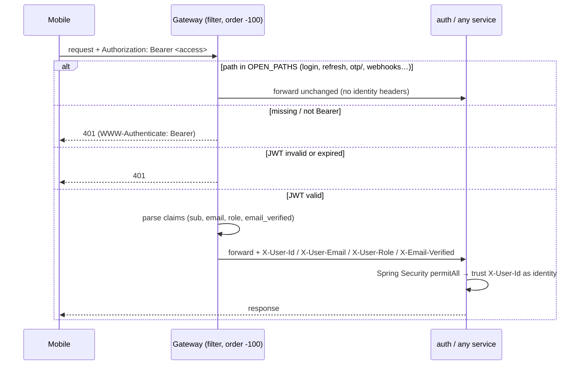
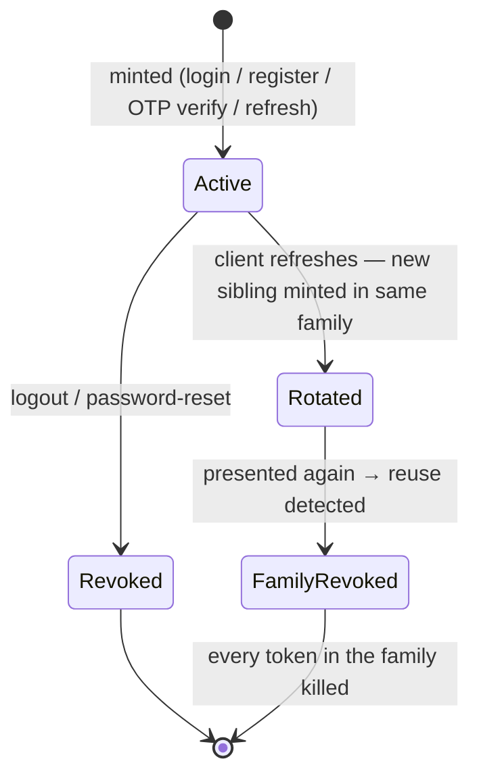
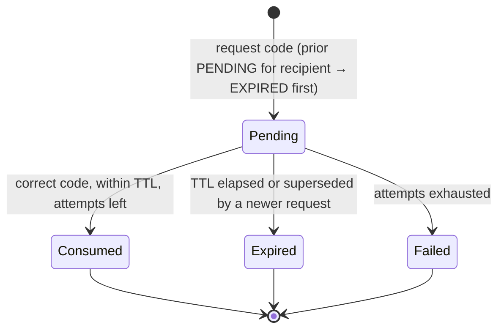

# 01 — Auth, the gateway & the `X-User-Id` trust model

This is the doc to read first after the overview, because the trust model it
describes is load-bearing for every other service. auth-service is also the
densest service in the system by surface area — it does identity, sessions
(token sessions, not shopping sessions), OTP across four purposes, email
verification, password reset, phone linking, account edits, and it owns shopping
lists. The reason all of that lives in one place is the same reason the gateway
exists: **identity is decided once, at the edge, and trusted everywhere
downstream.**

What auth-service owns, in one list: register/login (email+password), OTP login
(phone or email), JWT issue + refresh-token rotation, email verification,
password reset, phone linking, the `/me` account-edit endpoints, user
preferences, and per-user shopping lists.

---

## 1. The trust boundary — the one idea everything hangs on

The mobile app never talks to a service directly. It talks to the **gateway**,
and the gateway is the only component that understands a JWT. When a request
arrives, [JwtAuthenticationFilter](atlassync-backend/gateway/src/main/java/com/atlassync/gateway/filter/JwtAuthenticationFilter.java)
runs first (it's a `GlobalFilter` with `getOrder() == -100`), validates the
token's signature and expiry, and rewrites the request with four headers lifted
from the claims: `X-User-Id`, `X-User-Email`, `X-User-Role`, `X-Email-Verified`.
Downstream services never see or parse the JWT — they read `X-User-Id` and
believe it.

The set of paths that skip the JWT check — login, register, refresh, logout, the
`otp/` and `password/reset/` prefixes, the Stripe webhook, actuator, and `/ws` —
is a hardcoded `OPEN_PATHS` list in the filter. Everything else is closed by
default. That "closed unless explicitly opened" default is deliberate: forgetting
to add a route means it's *protected*, not exposed.

**Why this is good, and the exact shape of its danger.** The upside is real:
five services don't each re-implement JWT parsing, and adding a sixth service is
"add a route," not "wire up security." The downside is that every downstream
service is *unauthenticated by itself*. Look at auth-service's own
[SecurityConfig](atlassync-backend/auth-service/src/main/java/com/atlassync/auth/config/SecurityConfig.java#L31):
it `permitAll()`s `/api/auth/**` and `/api/lists/**` and trusts the header. That
is the model working as intended — and it's a footgun, because the day a service
is reachable on its own port without going through the gateway, the `X-User-Id`
header is just a number any caller can set. We already paid for the seam once:
when lists shipped, the auth `SecurityConfig` didn't `permitAll` the lists path,
so Spring Security returned **403 even though the gateway had already
authenticated the caller**. The fix (`fix/auth-service-permit-lists`) was to add
`/api/lists/**` to the permit list — i.e. to extend the same "trust the gateway"
decision to the new routes.

**The header is also how trust composes across services.** `email_verified`
isn't just informational. The gateway copies it into `X-Email-Verified`, and
[SessionController.java:36](atlassync-backend/session-service/src/main/java/com/atlassync/session/controller/SessionController.java#L36)
refuses to start a shopping session unless it's `"true"`. So a claim minted in
auth-service, forwarded by the gateway, gets *enforced* in session-service —
without session-service ever calling auth. That's the trust model paying off:
one identity decision, reused everywhere.

---

## 2. Tokens — short-lived access, rotating refresh

There are two tokens and they're deliberately different animals.

The **access token** is a stateless HS256 JWT, minted in
[JwtService.generateAccessToken](atlassync-backend/auth-service/src/main/java/com/atlassync/auth/service/JwtService.java#L35).
Its claims are `sub` (the user id), `email`, `role`, and `email_verified`, and it
lives 15 minutes (`jwt.access-expiration: 900000`). Stateless means the gateway
can validate it with just the shared secret — no database round-trip on every
request. That's the whole point of keeping it short-lived: a stolen access token
is only useful for 15 minutes, and nothing has to be revoked because it expires
on its own.

The **refresh token** is the opposite: an opaque random UUID
([generateRefreshToken](atlassync-backend/auth-service/src/main/java/com/atlassync/auth/service/JwtService.java#L51)),
not a JWT, lives 7 days, and is **stored SHA-256-hashed** in the
`refresh_tokens` table. It carries no claims because it's never parsed — it's
looked up. Storing only the hash means a database leak doesn't hand the attacker
usable tokens (same reasoning as password hashing). Validating it *requires* the
DB, which is exactly why `refresh` is an open path at the gateway: the gateway
can't validate it statelessly, so auth-service does.

### Rotation with reuse detection

Every refresh **rotates**: the presented token is marked `ROTATED` (revoked), and
a fresh one is minted in the same `family_id`. Tokens minted from one login share
a family. The payoff is theft detection — if a token that's already been rotated
is ever presented again, that means two parties hold the same refresh token, so
the whole family is burned. See
[AuthService.refresh](atlassync-backend/auth-service/src/main/java/com/atlassync/auth/service/AuthService.java#L96):
a revoked-token lookup triggers `revokeByFamilyId(..., REUSE_DETECTED)` and
throws.

`RevocationReason` (`ROTATED`, `LOGOUT`, `REUSE_DETECTED`, `ADMIN_REVOKE`,
`PASSWORD_RESET`) is stored on each row, so the table doubles as an audit trail of
*why* a session ended.

**Two tradeoffs worth being able to defend:**

- *HS256 (shared secret), not RS256 (asymmetric).* Both the gateway and
  auth-service hold the same `jwt.secret`. With HS256 anyone who can validate can
  also forge, so the secret has to be guarded on every holder. Here only the
  gateway validates, so the blast radius is two processes and the simplicity wins.
  If a dozen services each needed to validate tokens, RS256 (auth signs with a
  private key, everyone else verifies with the public key) would be the call.
- *Access tokens can't be revoked mid-life.* A stateless JWT is valid until it
  expires, full stop. The mitigation is the short 15-minute lifetime plus the
  fact that the refresh token — the thing that grants *longevity* — is revocable.
  Password reset leans on this: it revokes every refresh token but can't claw back
  an already-issued access token, so worst case an attacker keeps access for under
  15 minutes.

### Why account edits re-issue tokens

The `/me` endpoints —
[MeController](atlassync-backend/auth-service/src/main/java/com/atlassync/auth/controller/MeController.java) —
return a fresh `AuthResponse` (a whole new token pair) after changing a username,
preferences, or linking a phone. That looks heavy until you remember the access
token *embeds* `email`/`role`/`email_verified` as claims. Change an identity-
bearing field and the old token is now stale; re-issuing is how the client picks
up the new state immediately instead of waiting up to 15 minutes for the next
refresh. (The mild wart: each edit mints a new family without revoking the old
one, so long-lived clients accumulate orphan refresh tokens that just expire
unused. Fine at this scale; I'd note it before claiming the token table is tidy.)

---

## 3. OTP — one machine, four purposes

Phone-or-email OTP login, email verification, phone linking, and password reset
all run on the **same** `otp_challenges` table and the **same** primitives. They
differ only in the `purpose` column and in what a successful verify *does*.

| Purpose | Triggered from | Terminal action on verify |
|---|---|---|
| `LOGIN` | `POST /api/auth/otp/request` (phone) or `/otp/email/request` | create user on first verify, mint token pair |
| `EMAIL_VERIFICATION` | bootstrap on register + "verify now" | flip `email_verified = true` |
| `PHONE_VERIFICATION` | `POST /api/auth/me/phone/request` | attach phone to the authenticated user |
| `PASSWORD_RESET` | `POST /api/auth/password/reset/request` | replace password, revoke all refresh tokens |

The shared primitives live in
[OtpCodes](atlassync-backend/auth-service/src/main/java/com/atlassync/auth/service/OtpCodes.java):
`SecureRandom` digit generation, SHA-256 hashing, and a constant-time compare.
**Codes are stored hashed, never plaintext**, and compared in constant time so a
timing side-channel can't leak how many leading digits matched. Every challenge
also caps attempts (default 5), has a TTL (5 min), and — critically — issuing a
new code first marks any prior `PENDING` challenge for that recipient `EXPIRED`
([OtpService.issueChallenge](atlassync-backend/auth-service/src/main/java/com/atlassync/auth/service/OtpService.java#L106)),
so only the most recent code is ever live.

Keeping login-OTP in `OtpService` but email-verify / phone-link / password-reset
in their own services is a conscious split: they share machinery but their
*lifecycles* diverge (one mints tokens, the others mutate the `User` row), and
conflating them would make every path carry the others' branches.

### Pluggable delivery — a strategy pattern via Spring, not an `if`

`OtpService` injects a single `OtpDeliveryChannel`; it has no idea whether that's
SMS, WhatsApp, email, or a log line. The selection is wiring, not code: each
channel's config class is annotated
`@ConditionalOnProperty("atlassync.otp.delivery.provider", havingValue = "…")`,
and exactly one bean exists at runtime. The default is
[LogDeliveryChannel](atlassync-backend/auth-service/src/main/java/com/atlassync/auth/delivery/LogDeliveryChannel.java)
(`matchIfMissing = true`) — in dev the code just prints to the log, so you can
develop the whole flow with no SMS provider and no cost. Flip
`OTP_DELIVERY_PROVIDER` to `smsgate`, `whatsapp`, or `brevo` to send for real;
the [WhatsApp channel](atlassync-backend/auth-service/src/main/java/com/atlassync/auth/delivery/WhatsAppDeliveryChannel.java)
posts to Meta's Cloud API with a pre-approved authentication template. The
service never changes — adding a provider is adding a bean.

### The non-revealing password reset

[PasswordResetService.request](atlassync-backend/auth-service/src/main/java/com/atlassync/auth/service/PasswordResetService.java#L451)
returns the **same response whether or not the email exists**, and runs the rate
limiter *before* the user lookup so timing is identical either way. That denies
an attacker an email-existence oracle. And
[confirm](atlassync-backend/auth-service/src/main/java/com/atlassync/auth/service/PasswordResetService.java#L477)
revokes *every* refresh token the user holds, not just the calling client's — so
resetting a password kicks a session-hijacker out everywhere, which is the entire
point of "reset password" as a security action.

---

## 4. Rate limiting

OTP/verify/reset request endpoints are guarded by an
[InMemoryRateLimiter](atlassync-backend/auth-service/src/main/java/com/atlassync/auth/ratelimit/InMemoryRateLimiter.java):
a sliding-window counter (a per-key `Deque<Instant>`, old entries evicted on each
call, `synchronized` per key), default 3 requests per recipient per 15 minutes.
A rejected request becomes a `429` with a `Retry-After` header
([GlobalExceptionHandler](atlassync-backend/auth-service/src/main/java/com/atlassync/auth/exception/GlobalExceptionHandler.java#L69)).

Two honest limits of "in-memory": it's **per-instance**, so two auth-service
replicas would each allow the full quota — a horizontally-scaled deployment would
need Redis or a token-bucket backed by a shared store. And the key map isn't
swept, so it grows with the number of distinct recipients seen (a slow leak,
harmless at this scale). For a single-instance learning deployment this is the
right amount of engineering; I'd name the Redis upgrade path rather than pretend
the in-memory version is production-final.

---

## 5. Lists — the case study for "per-user CRUD owned by auth"

The cleanest illustration of the trust model is the shopping-lists feature,
which lives *inside* auth-service. Why here and not its own service? Because a
list is per-user CRUD keyed on exactly the identity auth already owns — splitting
it into a new service would buy a new database, a new deployment, and a network
hop, to manage rows whose only foreign key is `user_id`. The whole feature is one
controller, one service, two tables.

[ShoppingListController](atlassync-backend/auth-service/src/main/java/com/atlassync/auth/lists/ShoppingListController.java#L27)
reads `@RequestHeader("X-User-Id")` on every route — same pattern as
`MeController` — and
[ShoppingListService](atlassync-backend/auth-service/src/main/java/com/atlassync/auth/lists/ShoppingListService.java#L148)
enforces ownership *in the query*: `findByIdAndUserId(listId, userId)`. There is
no separate "is this your list?" check to forget; a list you don't own simply
isn't found, and the handler returns **404, not 403** — which also avoids
confirming the list exists at all. That's the trust model end to end: the gateway
proves who you are, the header carries it, and every data access is scoped by it.

---

## 6. The phone-first user, and what it broke

The system started as email+password. Phone-OTP login arrived later and quietly
violated assumptions the original model had baked in: an OTP user created on
first verify has **no email and no password**. The fix was
`eb61be3 user: add phone, allow email/password null` — the
[User entity](atlassync-backend/auth-service/src/main/java/com/atlassync/auth/entity/User.java)
made both columns nullable. The ripples are still visible as guards:
`EmailVerificationService.bootstrapForNewUser` no-ops when `email == null`,
`requireUnverifiedEmail` rejects verify attempts for email-less users, and
`OtpService.findOrCreateUser` branches on whether the recipient looks like an
email or a phone. Worth having ready, because "what happens to email verification
for a phone-only signup?" is exactly the kind of edge a reviewer probes.

---

## 7. Errors and failure modes

auth-service maps domain exceptions to RFC 9457 `ProblemDetail` responses in one
[GlobalExceptionHandler](atlassync-backend/auth-service/src/main/java/com/atlassync/auth/exception/GlobalExceptionHandler.java).
The status choices are intentional:

| Condition | Exception | Status | Why this code |
|---|---|---|---|
| Email/username already taken | `DuplicateResourceException` | 409 | the request conflicts with existing state |
| Bad password / unknown email | `BadCredentialsException` | 401 | same message both ways — no user-existence oracle |
| Refresh token unknown/expired | `InvalidTokenException` | 401 | re-auth required |
| Rotated token replayed | `TokenReuseException` | 401 | family already burned; client must log in |
| Wrong OTP code | `OtpInvalidCodeException` | 401 | bad credential |
| OTP/code TTL elapsed | `OtpChallengeExpiredException` | 410 Gone | the resource genuinely no longer exists |
| Too many OTP/reset requests | `OtpRateLimitedException` | 429 + `Retry-After` | client should back off, and we say for how long |
| Verify an already-verified email | `EmailAlreadyVerifiedException` | 409 | conflicts with current state |
| List not owned / missing | `ShoppingListNotFoundException` | 404 | don't confirm existence of others' data |
| Bean-validation failure | `MethodArgumentNotValidException` | 400 + field map | client-fixable input error |

Runtime failure modes to keep in pocket: **OTP delivery provider down** — the
channel throws `DeliveryException` and the request fails (no fallback channel;
acceptable since the user can retry, and dev defaults to the log channel anyway).
**auth-service restarted** — in-memory rate-limit counters reset, so quotas are
briefly generous; OTP challenges survive because they're in Postgres. **Clock
skew** — TTLs are absolute `Instant`s compared against `Instant.now()`, so a
badly-skewed host would expire codes early or late; not handled, worth noting.

---

## 8. How the mobile side consumes this

The mobile app holds both tokens in secure storage and treats the gateway as the
only endpoint. [AuthContext](atlassync-mobile/src/context/AuthContext.tsx) owns
the user object and persists the `AuthResponse` on login/register/refresh; the
axios layer in [client.ts](atlassync-mobile/src/api/client.ts) attaches the
access token on every request and, on a `401`, transparently refreshes once and
retries. The refresh is **single-flight** — a module-level `refreshInFlight`
promise means ten concurrent 401s trigger one refresh, not ten (which would race
the rotation and trip reuse detection on themselves). If refresh fails, it clears
storage and fires the unauthenticated handler, which drops `AuthContext` back to
logged-out. The screens (`app/auth/login.tsx`, `register.tsx`,
`forgot-password.tsx`, `reset-password.tsx`, `verify-email.tsx`) are thin wrappers
over the auth API; the interesting logic is all in those two files. The mobile
deep dive (07) covers the interceptor's race-safety in full.

---

*Previous: [00 — System Overview](00-overview.md) · Next: [02 — Product catalog & the scan path](02-product-catalog.md).*
