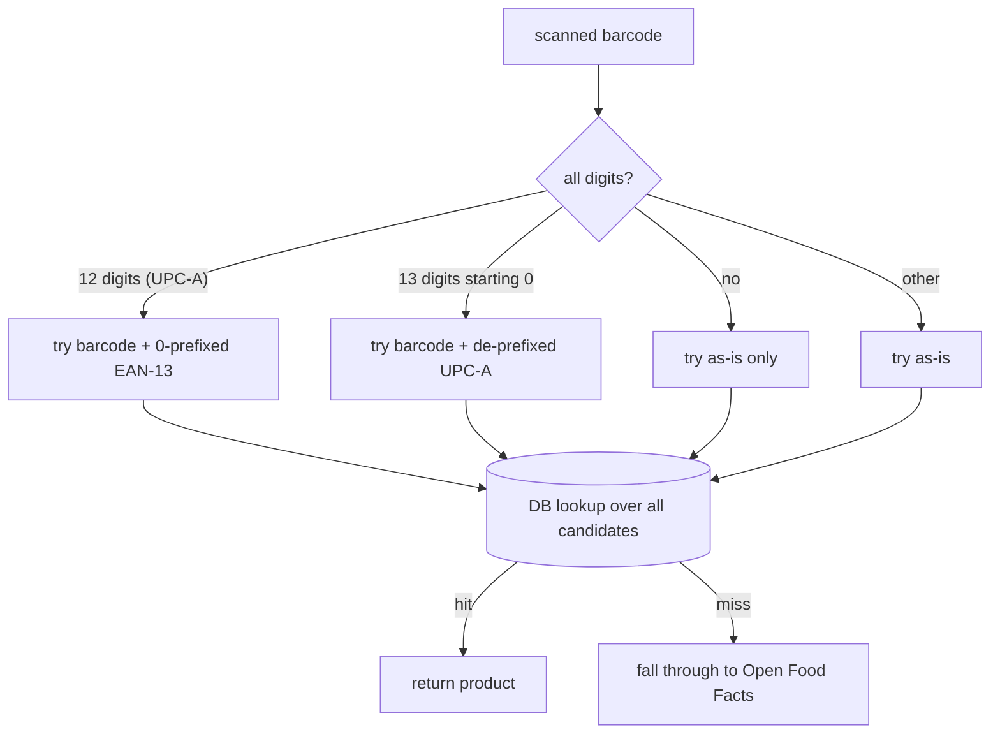

# 02 — Product catalog & the scan path

product-service is the only service sitting on the **scan hot path** — the loop a
shopper runs dozens of times per trip, camera pointed at a barcode, expecting the
item to appear in the cart instantly. So its whole design is shaped by two
pressures that pull against each other: the catalog has to feel like a real
supermarket (thousands of real products, real names, real images), but a lookup
has to resolve in milliseconds and never hang the scan even when an external API
is slow. The answer is a three-tier resolution — cache, then database, then Open
Food Facts — wrapped in fail-soft timeouts, plus an enrichment layer that
invents the commerce data OFF doesn't carry.

What product-service owns: barcode → product resolution, the Open Food Facts
import/enrichment pipeline, name/aisle search, and the gRPC endpoint cart-service
calls on every scan.

---

## 1. The scan path, end to end

A scan never hits product-service directly. The phone adds the item to the cart;
cart-service is the one that asks product-service "what is this barcode?" over
gRPC. product-service answers from cache if it can, the database if it must, and
Open Food Facts only as a last resort.

```mermaid
sequenceDiagram
    participant Cam as Phone camera
    participant C as cart-service
    participant P as product-service
    participant R as Redis (cache)
    participant DB as Postgres (catalog)
    participant OFF as Open Food Facts

    Cam->>C: add item { barcode }
    C->>P: gRPC getProduct(barcode)
    P->>R: @Cacheable "products" lookup
    alt cache hit
        R-->>P: Product
    else cache miss
        P->>DB: findByBarcode (all normalized forms)
        alt in DB
            DB-->>P: Product
        else not in DB
            P->>OFF: GET /product/{barcode}.json (1.5s timeout)
            alt OFF has it
                OFF-->>P: raw JSON
                P->>P: enrich (aisle, price, RFID, dietary…)
                P->>DB: save
            else miss / timeout
                OFF-->>P: nothing → Optional.empty()
            end
        end
        P->>R: cache result (1h TTL, misses not cached)
    end
    P-->>C: ProductResponse (or NOT_FOUND)
```

The two transports are deliberate. cart talks to product over **gRPC** because
it's a per-scan internal call where a compact binary contract and a generated
stub beat JSON parsing. The mobile **product detail screen**, by contrast, hits
`GET /api/products/{barcode}` over REST through the gateway, because that's a
human-facing call that wants the full record. Same data source, two faces — more
on that in §8.

---

## 2. Open Food Facts — a real catalog, bounded by a hard timeout

The catalog is backed by [Open Food Facts](https://world.openfoodfacts.org), an
open product database keyed by barcode. The win is obvious: scan a real Nutella
jar and you get "Nutella", the real image, the ingredient list and allergens —
instead of 14 hand-rolled demo rows. The cost is that OFF is a third party on the
critical path, so every call into it is wrapped defensively in
[OpenFoodFactsClient](atlassync-backend/product-service/src/main/java/com/atlassync/product/service/OpenFoodFactsClient.java).

Two guards matter. First, a **hard 1.5s read timeout** (1s connect) — if OFF is
slow, the scan fails soft and treats the barcode as "unknown" rather than making
the shopper wait. Second, `fetchRaw` swallows timeouts and connection errors and
returns `null`, which the caller reads as a miss
([OpenFoodFactsClient.java:61](atlassync-backend/product-service/src/main/java/com/atlassync/product/service/OpenFoodFactsClient.java#L61)).
The principle: **OFF being down degrades the catalog, it never breaks the scan.**
A product already in the database (the common case) never touches OFF at all, so
this timeout only ever bites the first-ever scan of a brand-new barcode.

---

## 3. The enricher — inventing the commerce data OFF lacks

OFF is rich on *labelling* — allergens, dietary flags, categories, nutrition —
and bare on *commerce* — no price, no stock, no aisle, no security flag. A real
store would feed those from a POS/ERP system; here,
[ProductEnricher](atlassync-backend/product-service/src/main/java/com/atlassync/product/service/ProductEnricher.java)
synthesizes them with policies tuned for a Moroccan store. This is the most
"product-y" code in the service and the part most worth being able to defend,
because it's where raw reference data becomes a sellable catalog item.

The core inference is **aisle from category**. OFF tags each product with
`categories_tags` like `en:yogurts`, `en:dairies`, `en:plant-based-foods` —
ordered generic-to-specific. The enricher walks them **in reverse** so the most
specific tag wins (`en:yogurts` → dairy aisle 5, not the generic
`en:plant-based-foods`), falling back to aisle 9 (pantry) when nothing matches
([inferAisle](atlassync-backend/product-service/src/main/java/com/atlassync/product/service/ProductEnricher.java#L158)).
Aisle then drives two more fields: a per-aisle baseline **price** in MAD, and the
**RFID security flag**, set for the seafood (11) and meat/halal (12) aisles —
the high-value counters a real store gates at the exit.

| Aisle | Section | Baseline price (MAD) | RFID-gated |
|---|---|---|---|
| 1 | Produce | 12.00 | no |
| 5 | Dairy | 18.00 | no |
| 7 | Beverages | 10.00 | no |
| 8 | Bakery | 15.00 | no |
| 9 | Pantry (default) | 28.00 | no |
| 11 | Seafood | 130.00 | **yes** |
| 12 | Meat / Halal | 70.00 | **yes** |
| 13 | Snacks | 16.00 | no |

The labelling data is *mapped*, not passed through raw: OFF's `allergens_tags`
and `labels_tags` get translated into the exact vocabulary the mobile app uses
(`en:gluten` → "Gluten", `en:vegan` → "Vegan") so the app can match a product's
flags against a user's saved allergen/dietary preferences without a translation
layer of its own. Dietary detection also falls back to
`ingredients_analysis_tags` for products that declare vegan/vegetarian there but
not in `labels_tags`. Nutrition is reduced to the per-100g six (energy, fat,
carbs, protein, salt, sugar) and stored as `jsonb`.

The honest caveat to volunteer: the prices are **demo-grade** — a flat per-aisle
baseline, not a real price book. In production this whole class would be replaced
by a feed from the store's pricing system; the enricher is the seam where that
feed would plug in.

---

## 4. Caching — Redis on the hot path

[ProductService.findByBarcode](atlassync-backend/product-service/src/main/java/com/atlassync/product/service/ProductService.java#L27)
is annotated `@Cacheable("products")`, backed by Redis with a **1-hour TTL**
([RedisConfig](atlassync-backend/product-service/src/main/java/com/atlassync/product/config/RedisConfig.java#L36)).
This is classic cache-aside, but Spring's `@Cacheable` does the legwork: a hit
returns without ever entering the method, a miss runs the DB→OFF resolution and
caches the result. Redis earns its place specifically because this is the scan
hot path — the same popular barcodes get scanned over and over, and a Redis read
is sub-millisecond against a Postgres round-trip.

One config choice has a real consequence: `disableCachingNullValues()`. A barcode
that resolves to nothing is **not** cached. The upside is correctness — a product
that gets added to OFF tomorrow will be found tomorrow, instead of being stuck as
a cached "miss." The downside is that an unknown barcode re-pays the full DB+OFF
resolution (including that 1.5s timeout) on *every* scan. For a learning catalog
that's an acceptable trade; at scale you'd cache misses with a short negative-TTL
to stop hammering OFF. Values are serialized as JSON with default typing on, so
the polymorphic `nutriments`/`attributes` maps round-trip cleanly.

---

## 5. Barcode normalization — a real camera bug

This one is pure field experience.
[normaliseCandidates](atlassync-backend/product-service/src/main/java/com/atlassync/product/service/ProductService.java#L67)
exists because phone cameras don't agree on barcode format. iOS in particular
returns an EAN-13 code that begins with `0` as its 12-digit **UPC-A** equivalent
— same code, leading zero stripped. So the barcode the camera hands you might not
be the string sitting in the database, even though they're the same physical
product.



The fix (`9466127 normalise upc-a and ean-13 barcode forms`) generates every
plausible form and checks them all against the DB before falling back to OFF. It
applies on both single lookup and the batch/cart-refresh path
(`findByBarcodes`), so a cart rehydrated from stored barcodes resolves regardless
of which form was originally captured. This is exactly the kind of thing a
reviewer can't guess from the design but is gold to be able to explain — it's a
bug the physical world handed us.

---

## 6. The catalog importer — a catalog that feels real on first boot

So the catalog isn't empty on a fresh database,
[CatalogImporter](atlassync-backend/product-service/src/main/java/com/atlassync/product/service/CatalogImporter.java)
seeds ~25 curated real barcodes from OFF on startup — internationally-sold brands
with good OFF coverage (Nutella, Évian, Coca-Cola, Barilla, KitKat) plus a few
Moroccan brands where coverage is patchier. Three design choices:

- It runs on a **background daemon thread** off `ApplicationReadyEvent`, so ~25
  sequential HTTP calls don't block startup — the service accepts traffic
  immediately and the catalog fills in over ~30 seconds.
- It's **idempotent**: each barcode is skipped if already present, so it's safe to
  leave enabled across restarts and safe to run against a populated DB.
- It's **fail-soft** on OFF misses — a barcode OFF doesn't know is logged and
  skipped, not fatal. (Toggle off entirely with `catalog.import-on-boot=false`.)

This is seed data with a purpose: it makes the demo feel like a store, and it's
the source of the `products` rows the silver Spark job later JOINs against for
category/brand (doc 06).

---

## 7. Search

Name search is a naive JPQL substring match —
`LOWER(name) LIKE LOWER('%query%')`
([ProductRepository](atlassync-backend/product-service/src/main/java/com/atlassync/product/repository/ProductRepository.java#L20))
— optionally scoped to an aisle (`searchByNameAndAisle`), or an aisle-only browse
(`findByAisleNumber`). It's honest to call this what it is: fine for a few hundred
to a few thousand rows, but it can't use an index (the leading `%` defeats a
btree) and it doesn't do typo-tolerance or ranking. The scale answer is a
Postgres `pg_trgm` GIN index or a `tsvector` full-text column; I left it naive on
purpose because the catalog is small and search isn't the hot path — scanning is.

---

## 8. Two faces: lean gRPC, full REST

product-service exposes the same data two ways, and the difference is the point.

[ProductGrpcService.getProduct](atlassync-backend/product-service/src/main/java/com/atlassync/product/grpc/ProductGrpcService.java#L35)
returns a **lean** `ProductResponse` — only what the cart needs to add a line:
barcode, name, price, currency, image, nutriscore, aisle, RFID flag, and the
attributes JSON. A missing product comes back as a gRPC `NOT_FOUND` status, not an
empty object. Notably, **price is sent as a string** (`getPrice().toPlainString()`),
not a float — money over the wire as a decimal string avoids every
binary-floating-point rounding trap, and the cart parses it straight into a
`BigDecimal`.

The REST `ProductDto` (via
[ProductMapper](atlassync-backend/product-service/src/main/java/com/atlassync/product/dto/ProductMapper.java))
is the **full** record — it adds `categoryId`, `novaGroup`, `ingredientsText`,
the allergen array, stock, and full nutriments — everything the product detail
screen renders. The cart doesn't need ingredient text; the detail screen does. So
the gRPC contract stays minimal and the REST DTO stays complete, instead of one
bloated shape serving both.

One modelling seam worth naming: the enricher sets `aisleNumber` (physical
location) but leaves `categoryId` **null** — `categoryId` is a separate taxonomy
populated only on Flyway-seeded rows. That's why the silver Spark job's
category JOIN comes back null for OFF-imported products (you saw this in the doc
06 cross-check). Aisle and category are two different axes; only one of them is
inferred.

---

## 9. The mobile scan screen

The camera side ([app/shop/scan.tsx](atlassync-mobile/app/shop/scan.tsx)) is an
`expo-camera` `CameraView` with `onBarcodeScanned`, and its one non-obvious piece
is a **dedupe cooldown**. A live camera fires `onBarcodeScanned` many times per
second while it's pointed at the same barcode — without a guard you'd add thirty
of the same item in one second. So a `lastFireRef` (a `useRef`, kept *outside*
React state so the camera callback always reads the current value, not a stale
closure) ignores the same barcode within a short window. On a successful scan it
calls `scanItem(barcode)` (which routes to cart-service), then fetches the full
product via `productsApi.byBarcode` to populate the on-screen "peek" card; an
unknown barcode shows an explicit unknown state with a "search manually" escape
hatch. There's also a `__DEV__`-only simulate button that fires a random seeded
barcode, since the iOS simulator's camera can't scan a real one — which is what
the `tools/test-barcodes.html` page is for on a real device.

---

## 10. Failure modes

| Situation | What happens | Why it's acceptable |
|---|---|---|
| OFF slow / down | 1.5s timeout → treated as unknown barcode | products already in DB are unaffected; only first-ever scans of new barcodes feel it |
| Barcode unknown to OFF | `Optional.empty()` → gRPC `NOT_FOUND` → mobile "unknown" peek + manual search | shopper can still find the item by name |
| Same barcode scanned 30×/sec | dedupe cooldown drops repeats | one tap of the camera = one item |
| UPC-A vs EAN-13 mismatch | all candidate forms tried before OFF | scan resolves regardless of camera format |
| Redis down | `@Cacheable` miss → straight to DB | catalog still resolves, just slower |
| Unknown barcode re-scanned | not cached → re-pays DB+OFF each time | correctness over speed for misses; negative-TTL is the scale fix |

---

*Previous: [01 — Auth & the gateway](01-auth-and-gateway.md) · Next: [03 — Cart-service: cache-aside, gRPC & real-time](03-cart-service.md).*
