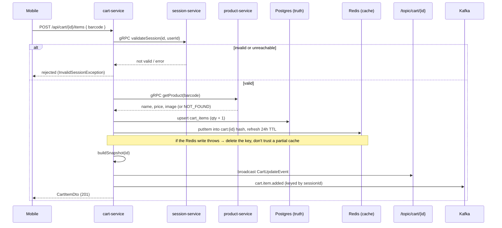
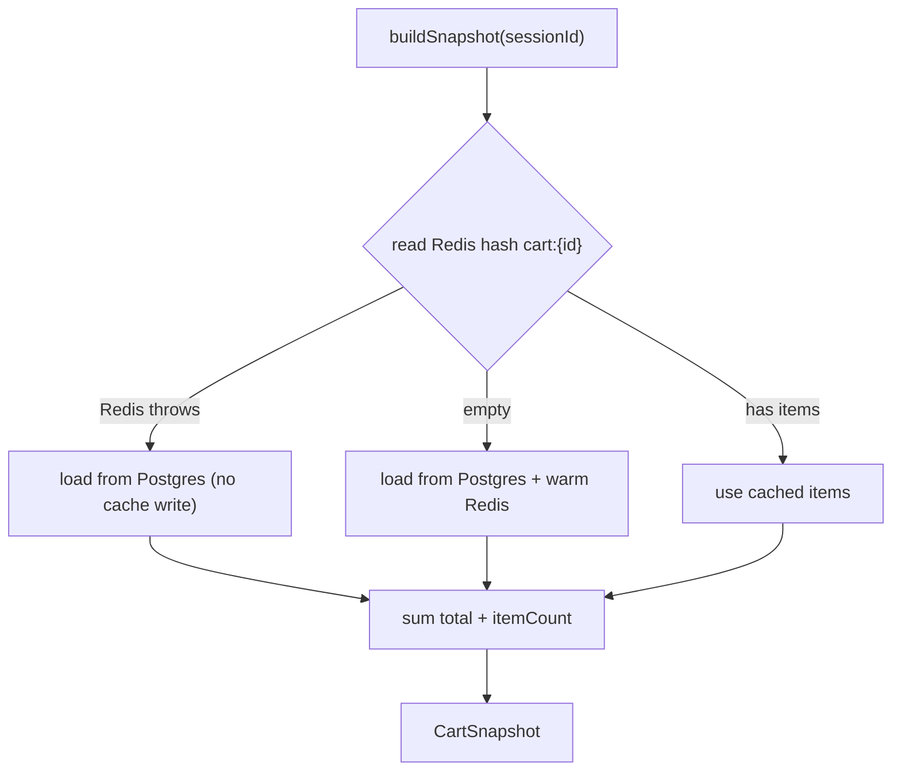

# 03 — Cart-service: cache-aside, gRPC & real-time

cart-service holds the live shopping cart for a session — the thing that grows by
one every time the shopper scans an item. It's a small service with three
patterns worth studying because each is a distinct architectural decision: a
**Redis cache over a Postgres source of truth** that self-heals when Redis
hiccups, **gRPC fan-out** to product-service and session-service on every
mutation, and a **STOMP WebSocket broadcast** for live cart updates. It also
emits Kafka events. I'll be honest up front about which of these are load-bearing
today and which are built-ahead-of-use, because that distinction is exactly the
kind of thing a reviewer will press on.

---

## 1. Two stores, one truth

A cart lives in two places at once, and knowing which one is authoritative is the
whole game.

**Postgres `cart_items` is the source of truth.** One row per line, with a unique
constraint on `(session_id, product_id)`
([CartItem](atlassync-backend/cart-service/src/main/java/com/atlassync/cart/entity/CartItem.java#L21))
so a barcode can't be duplicated within a session — a re-scan increments the
existing row's quantity instead. It stores `price_at_addition`, which matters:
the price is frozen at the moment the item went in the basket (more on that in
§3).

**Redis is the cache.** Each cart is a single Redis **hash**, key
`cart:{sessionId}`, fields keyed by barcode, values the serialized
`CartItemDto` ([CartRedisService](atlassync-backend/cart-service/src/main/java/com/atlassync/cart/service/CartRedisService.java#L23)).
A hash (not one key per item) means the whole cart reads in one round-trip and
individual items update in place. The key carries a **24-hour TTL refreshed on
every write**, so an abandoned cart simply evaporates a day after the last scan.

That TTL is a deliberate design statement: **the cart is ephemeral by design.**
Which is precisely why session-service snapshots the cart into its *own* durable
table at checkout — once payment completes, the receipt can't depend on a Redis
key that's going to expire. The cart is the scratchpad; the session record is the
permanent receipt (doc 04). Why keep Postgres at all if Redis holds the live
cart? Because Redis is a cache you must be able to lose: a flush, an eviction, a
restart can't drop a half-built basket, and the snapshot-at-checkout reads need a
store that's actually durable.

---

## 2. Cache-aside with self-heal — the headline pattern

Every mutation writes **both** stores, treats Postgres as authoritative, and
treats any Redis failure as a reason to *invalidate* the cache rather than trust
it.

The self-heal shows up on both the write and the read side. On a write, if
`putItem` throws, the code calls `safeDeleteRedis` to drop the whole cached cart
([CartService.java:79](atlassync-backend/cart-service/src/main/java/com/atlassync/cart/service/CartService.java#L79))
— a deleted cache is safe (the next read rebuilds it from Postgres), a *partially
written* cache is not. On a read,
[buildSnapshot](atlassync-backend/cart-service/src/main/java/com/atlassync/cart/service/CartService.java#L142)
prefers Redis but degrades cleanly:

Three distinct outcomes: a cache hit serves from Redis; a cache *miss* (empty
hash) loads from Postgres and **warms** the cache for next time; a Redis *error*
falls straight through to Postgres and doesn't try to write back. The totals
(`total`, `itemCount`) are always recomputed from whichever item list won — the
snapshot never trusts a stored aggregate. Net effect: **Redis being down makes
the cart slower, never wrong.**

---

## 3. gRPC fan-out, and the price-authority chain

Before cart-service touches its own data on a mutation, it makes two synchronous
gRPC calls.

First, [validateSession](atlassync-backend/cart-service/src/main/java/com/atlassync/cart/grpc/SessionServiceGrpcClient.java#L17)
against session-service — is this a real, active session? This is **fail-closed**:
if the session isn't valid, *or* session-service can't be reached, the call
throws `InvalidSessionException` and the mutation is refused. The reasoning is
that a cart only means something attached to a valid session; better to reject a
scan than to grow a cart nobody can pay for. The cost is a hard runtime
dependency — session-service down means no scanning — which is the honest price of
fail-closed.

Second, [getProduct](atlassync-backend/cart-service/src/main/java/com/atlassync/cart/grpc/ProductServiceGrpcClient.java#L18)
against product-service for the name, price, and image. A gRPC `NOT_FOUND` becomes
a `ProductNotFoundException`; any other gRPC error propagates. Both clients are
plain blocking stubs wired by `@GrpcClient` to `static://localhost:9082` (product)
and `9084` (session). gRPC is the right transport here precisely because these are
internal, per-scan calls on a typed contract — a generated stub and a compact
binary frame beat hand-rolled JSON over HTTP for something that runs dozens of
times per trip.

This is also where the **price authority chain** lives, and it's clean:
product-service *owns* the price, cart-service *freezes* it as `price_at_addition`
when the item goes in, and session-service later *sums* those frozen prices for
the PaymentIntent. A re-scan of the same item only bumps quantity — it does not
re-price the existing line. So a shopper pays the price they saw when they
dropped it in the basket, even if the catalog price moves before checkout. That's
a defensible policy choice (the alternative — price at checkout — is also valid; a
real store picks one and this one picks add-time), and it's the kind of decision
worth being able to state plainly rather than discover live.

---

## 4. Identity here is looser than in auth — and that's a real seam

Worth flagging honestly: cart-service does **not** enforce identity the way
auth-service's lists do. The `X-User-Id` header is `required = false` on the
add/remove endpoints, and `getCart`/`clearCart` don't read it at all
([CartController](atlassync-backend/cart-service/src/main/java/com/atlassync/cart/controller/CartController.java#L48)).
The cart effectively treats the **session UUID as a capability**: if you have the
session id, you can read or mutate that cart. Ownership — does this session belong
to this user — is delegated to `session.validateSession`, and even that is only as
strong as the `userId` passed (which can be empty).

Combined with the WebSocket endpoint being open at the gateway (§5), the session
id is functionally a bearer secret. It's a random UUID so it's not *guessable*,
but this is "security by unguessable id," not real authorization. For a
single-shopper MVP where the session id never leaves the owner's phone that's an
acceptable trade; I'd name it as a known gap rather than claim the cart is
access-controlled. The fix, if it mattered, is to validate the gateway's
`X-User-Id` against the session's owner on every cart call.

---

## 5. The WebSocket broadcast — built, not yet consumed

cart-service is set up to push live cart updates over STOMP. The
[WebSocketConfig](atlassync-backend/cart-service/src/main/java/com/atlassync/cart/config/WebSocketConfig.java)
registers a `/ws` endpoint and an in-process simple broker on `/topic`, and
[CartBroadcastService](atlassync-backend/cart-service/src/main/java/com/atlassync/cart/service/CartBroadcastService.java)
sends a `CartUpdateEvent` to `/topic/cart/{sessionId}` after every mutation. The
gateway proxies `/ws/**` to cart-service and leaves it open (no JWT). So the
backend half of "your cart updates in real time" is complete.

Here's the honest part: **the mobile app doesn't subscribe to it.** The
`@stomp/stompjs` library is even in `package.json` and `WS_URL` is computed in
[constants/api.ts:20](atlassync-mobile/src/constants/api.ts#L20) — but nothing in
the app imports the client or opens the socket. The phone keeps its cart current
the simple way: after each scan, `SessionContext.scanItem` awaits the REST add and
then calls `refreshCart()` to pull the authoritative snapshot back
([SessionContext.tsx:65](atlassync-mobile/src/context/SessionContext.tsx#L65)).

So why keep the broadcast? Because it's the seam for the things a single phone
can't do alone: a second display at the trolley, a store-associate dashboard
watching live baskets, or the `help.requested` flow paging staff. The broadcast
is real infrastructure waiting on a consumer — but I won't claim "the cart stays
live over WebSocket" when today it stays live over refresh-after-scan. (One real
limit if it *were* wired: the simple broker is in-process, so it only works for a
single cart-service instance; multiple instances would need a broker relay like
RabbitMQ or Redis pub/sub so a socket on instance A sees a mutation on instance
B.)

---

## 6. Kafka events

Every mutation also emits a Kafka event —
[CartEventProducer](atlassync-backend/cart-service/src/main/java/com/atlassync/cart/kafka/CartEventProducer.java)
publishes `cart.item.added`, `cart.item.removed`, and `help.requested`, each
**keyed by `sessionId`** so all events for one cart land in the same partition and
keep their order. These are JSON-serialized.

Two clarifications that prevent confusion later. First, these are *not* the events
that drive analytics — the lakehouse consumes `purchases.completed`, which
session-service emits at checkout (doc 06), not these per-scan cart events.
Second, like the WebSocket, these events currently have **no consumer** in the
system; they're emitted for decoupling and future use (the most obvious being
`help.requested` → a notification/associate service that isn't built yet, which
is why the `atlassync_notification` database exists as an empty stub). Producing
an event with no consumer is cheap and keeps the producer side honest; I'd just
not oversell it as a working feature.

---

## 7. Failure modes

| Situation | What happens | Why it's acceptable |
|---|---|---|
| session-service down/unreachable | `validateSession` throws → scan refused (fail-closed) | a cart with no valid session is meaningless; better to reject than orphan |
| product-service returns NOT_FOUND | `ProductNotFoundException` → 4xx, item not added | mobile shows the unknown-barcode state from doc 02 |
| Redis write fails mid-mutation | cache key deleted; Postgres write stands; next read rebuilds | partial cache is the danger, not a missing cache |
| Redis read fails | snapshot falls back to Postgres | cart is correct, just a round-trip slower |
| Redis evicts / TTL expires | next read warms cache from Postgres | Postgres is the truth; Redis is rebuildable |
| Two scans of the same barcode | unique `(session_id, product_id)` → quantity increments | no duplicate lines; price stays frozen at first add |
| cart-service restarts | in-flight WebSocket subscribers drop; carts intact in Postgres | state isn't in the process; it's in Postgres/Redis |

---

## 8. How the mobile side consumes it

The mobile cart flow is deliberately dumb on the client and authoritative on the
server. `SessionContext` exposes `scanItem` / `removeItem`, each of which calls
the REST endpoint and then `refreshCart()` — the UI never does cart math locally,
it renders whatever `CartSnapshot` the server returns (items, `total`,
`itemCount`, all computed server-side in `buildSnapshot`). That keeps the phone
and the server from disagreeing about the total, which is the number that
eventually becomes a charge. The review/pay screen reads the same snapshot. The
one place the client *does* add arithmetic is the display-only 8.75% tax line on
the review screen — which, as noted in the overview, the server's PaymentIntent
doesn't actually charge; that discrepancy is unpacked in the payments deep dive.

---

*Previous: [02 — Product catalog & the scan path](02-product-catalog.md) · Next: [04 — Session lifecycle: state machine, QR & the gate](04-session-lifecycle.md).*
