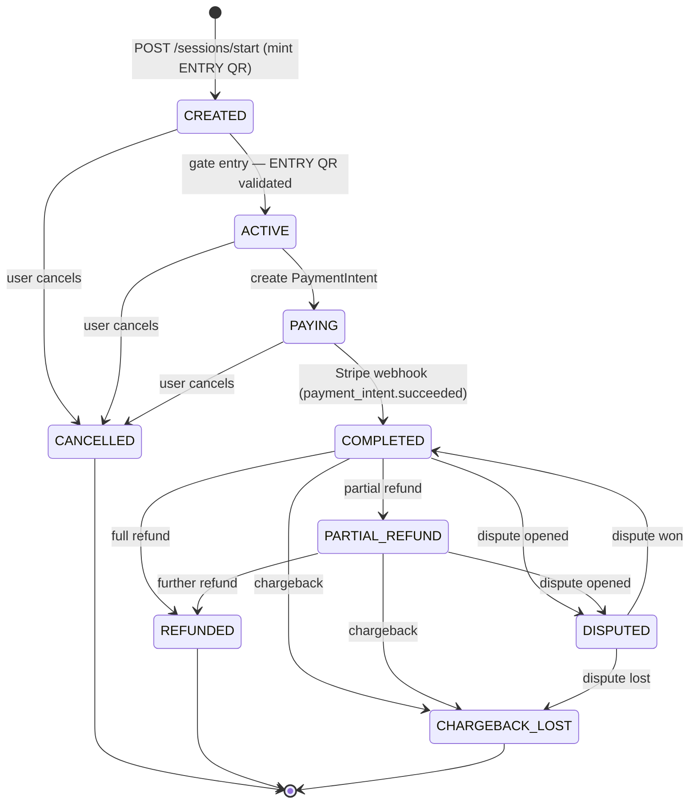
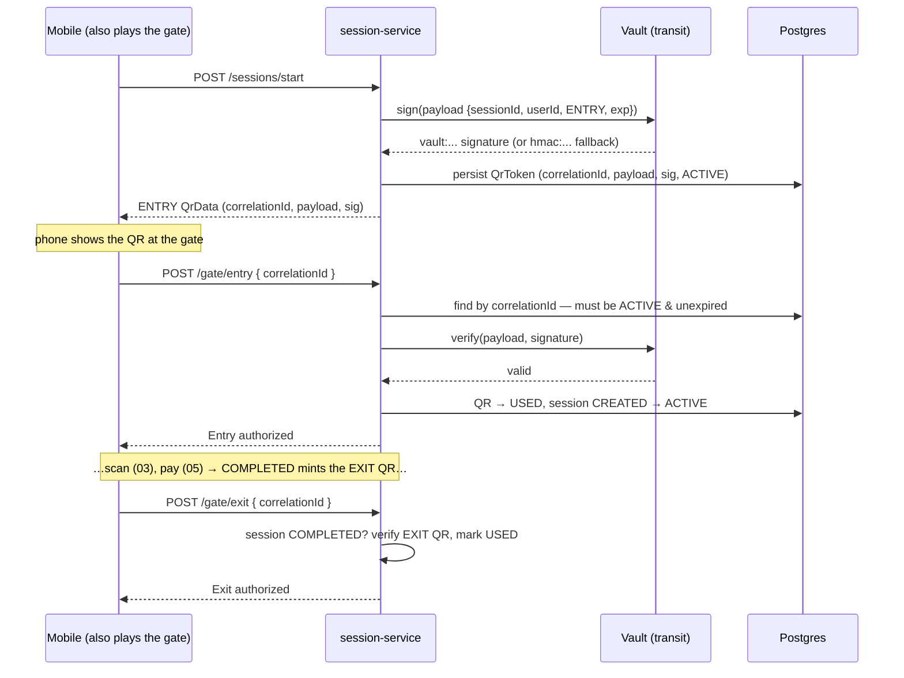

# 04 — Session lifecycle: state machine, QR & the gate

The shopping session is the one truly **stateful** object in AtlasSync, and
session-service is the spine that ties everything else together: it gates on
identity from auth, reads the cart from cart-service, takes money through Stripe,
and authorizes the physical gate. A session has a real lifecycle — created,
walked through an entry gate, paid, completed, possibly refunded or disputed — and
the service's job is to make sure that lifecycle can only advance in legal ways and
leaves an audit trail of how it got where it is.

This doc covers the state machine, the signed QR tokens and the gate, and the
cart-snapshot freeze. The Stripe mechanics that drive the payment transitions are
their own deep dive (05) — here I treat "the webhook said it's paid" as a black
box and focus on what the *session* does with that.

---

## 1. The state machine

A session is a [SessionStatus](atlassync-backend/session-service/src/main/java/com/atlassync/session/entity/SessionStatus.java)
with nine values, and the only way to move between them is
[`ShoppingSession.transitionTo`](atlassync-backend/session-service/src/main/java/com/atlassync/session/entity/ShoppingSession.java#L76),
which holds a hardcoded map of which states each state may move to. Ask for an
illegal move and it throws `IllegalStateTransitionException` — the transition
table *is* the rulebook, in one method.

The happy path is `CREATED → ACTIVE → PAYING → COMPLETED`. The post-`COMPLETED`
states exist because money doesn't stop moving when the shopper walks out —
refunds, partial refunds, and chargebacks can land days later, and the session has
to represent them. `DISPUTED → COMPLETED` is the "we won the dispute, money stays"
edge; `CANCELLED`, `REFUNDED`, and `CHARGEBACK_LOST` are terminal (empty outgoing
set).

**Why a guarded state machine and not just a status column you `UPDATE`?** Because
the transitions are where correctness lives. A late Stripe webhook must not be
able to move a `CANCELLED` session to `COMPLETED`; the guard makes that a thrown
exception instead of a silent bad write. The
[Stripe webhook handler](atlassync-backend/session-service/src/main/java/com/atlassync/session/payment/StripeWebhookController.java)
catches exactly that `IllegalStateTransitionException` and acks the webhook (200)
so Stripe stops retrying a move that will never be legal — the state machine and
the retry policy cooperate.

Two more safety layers wrap the machine:

- **Optimistic locking.** `ShoppingSession` carries a JPA `@Version`
  ([line 60](atlassync-backend/session-service/src/main/java/com/atlassync/session/entity/ShoppingSession.java#L60)),
  so two concurrent writers to the same session — say a webhook and a user action
  racing — can't both win; the loser gets an `OptimisticLockException`. (That same
  `@Version` does double duty as the Stripe idempotency key; that trick is doc 05.)
- **An audit trail.** Every transition writes a
  [SessionStateTransition](atlassync-backend/session-service/src/main/java/com/atlassync/session/entity/SessionStateTransition.java)
  row — `from_state`, `to_state`, `transitioned_at`, and a `triggered_by` tag
  (`gate-entry`, `user:42`, `stripe-webhook`, `payment-service`). You can
  reconstruct the entire history of any session and say *who* moved it at each
  step, which is exactly what you want when a payment dispute asks "what happened
  to this order?"

---

## 2. Signed QR tokens and the gate

Entry and exit are mediated by single-use, signed QR tokens. Starting a session
mints an `ENTRY` token; completing payment mints an `EXIT` token. Each is a
[QrToken](atlassync-backend/session-service/src/main/java/com/atlassync/session/entity/QrToken.java)
row with a random `correlationId` (the handle the QR actually encodes), the signed
`payload`, the signature, an `expiresAt` (24h), and a `status`
(`ACTIVE → USED`, plus `EXPIRED`/`REVOKED`).

The payload is a small JSON object — `{sessionId, userId, type, expiresAt}` —
signed by [QrSigningService](atlassync-backend/session-service/src/main/java/com/atlassync/session/service/QrSigningService.java).
The primary signer is **Vault's transit engine** with an ECDSA-P256 key
(`qr-signing-key`, created in
[init-vault.sh](atlassync-backend/infrastructure/vault/init-vault.sh)); if Vault
is unreachable, it falls back to an in-process **HMAC-SHA256** and tags the result
so `verify` knows which path to use (`vault:` vs `hmac:` prefix).

Three security properties hold on the gate path
([findAndValidateQrToken](atlassync-backend/session-service/src/main/java/com/atlassync/session/service/SessionService.java#L575)):

1. **Single use.** Validation flips the token `ACTIVE → USED`, and a non-`ACTIVE`
   token is rejected. The same QR can't open the gate twice — replay protection.
2. **Expiry.** Past `expiresAt`, the token is marked `EXPIRED` and refused.
3. **Tamper-evidence.** The stored payload is re-verified against its signature on
   every gate hit. Because the transit key lives in Vault and the app never holds
   it, you can't alter a token's `payload` (its `userId`, its `expiresAt`) in the
   database and have it still verify.

Two honest framings worth stating plainly, because a sharp reviewer will get
here. First, **the gate is currently the phone itself** — there's no separate
turnstile hardware; the mobile app calls `/api/gate/entry|exit` with the
`correlationId` it's holding. In a real store the gate would be its own
authenticated device. Second, because the gate transmits only the `correlationId`
and the server re-verifies its *own stored* signature, the signing buys
**tamper-evidence on the token row**, not offline QR verification (a gate
verifying a code without calling the server). The infrastructure is built for the
stronger model; the flow in place uses the online-lookup model. And the HMAC
fallback weakens the tamper-evidence to an app-held secret — fine for keeping dev
running when Vault is down, not the production posture.

---

## 3. The snapshot freeze — why receipts live here

When a session completes (whether via the webhook or the legacy path),
[snapshotCartIntoSession](atlassync-backend/session-service/src/main/java/com/atlassync/session/service/SessionService.java#L407)
pulls the cart from cart-service over plain HTTP and **freezes** each line into a
[SessionLineItem](atlassync-backend/session-service/src/main/java/com/atlassync/session/entity/SessionLineItem.java)
row — barcode, name, quantity, the unit price *as paid*, the line total, image,
timestamp. The entity's own comment says it best: it lives in session-service
"so receipts survive the cart's Redis TTL — once a session closes, the line items
here are the authoritative record."

This closes the loop with doc 03. The cart is deliberately ephemeral (a Redis hash
with a 24h TTL); if the receipt depended on that cart, it would evaporate a day
after checkout. So at the moment of completion the session copies the cart into
its own durable Postgres table and never reads the cart again. That frozen list is
what the receipt endpoint serves, and it's also the source of the `items[]` array
in the `purchases.completed` event the analytics pipeline consumes (doc 06).

The snapshot call is intentionally over **HTTP, not gRPC**, and intentionally thin
([CartSnapshotClient](atlassync-backend/session-service/src/main/java/com/atlassync/session/integration/CartSnapshotClient.java)):
it's a one-shot at checkout, not a hot-path call, so the binary-contract argument
that justified gRPC for the scan loop (doc 03) doesn't apply. And it's fail-soft —
if cart-service can't be reached, the session still completes with empty line
items rather than blocking a payment that already cleared. A receipt with missing
lines is recoverable; a session stuck mid-completion because a sidecar was down is
not.

---

## 4. Where idempotency and replay-safety live

The roadmap asks where idempotency lives in this service; it's spread across four
mechanisms, each guarding a different failure:

| Mechanism | Guards against | How |
|---|---|---|
| `transitionTo` guard | illegal/late state moves | throws `IllegalStateTransitionException` on a disallowed edge |
| Idempotent webhook handlers | Stripe re-delivering the same event | `markPaidFromWebhook` no-ops if already `COMPLETED`; refund/dispute handlers skip if already in target state |
| Single-use QR (`ACTIVE → USED`) | replaying a QR to re-open the gate | a used or expired token is refused |
| `@Version` optimistic lock | concurrent writers racing a session | second writer gets `OptimisticLockException` |

The webhook idempotency matters most in practice: Stripe *will* re-deliver, and
`markPaidFromWebhook` is written so a second delivery of `payment_intent.succeeded`
sees `status == COMPLETED` and returns without re-snapshotting or re-emitting
events. That's what lets the handler safely return `500` on a transient failure to
*invite* a retry — the retry can't double-charge the session's downstream effects.

---

## 5. The gRPC surface

session-service runs a gRPC server on `9084` with two methods, of which one is
load-bearing.
[validateSession](atlassync-backend/session-service/src/main/java/com/atlassync/session/service/SessionGrpcService.java#L26)
is what cart-service calls before every cart mutation (doc 03): it looks the
session up, returns `PERMISSION_DENIED` if the `userId` doesn't own it,
`NOT_FOUND` if it doesn't exist, and otherwise reports `valid = (status == ACTIVE)`.
That `ACTIVE`-only rule is why you can only add to a cart between walking through
the entry gate and starting payment — a `CREATED` or `PAYING` session rejects new
items.

`createExitToken` is implemented (it generates a standalone exit QR for a
`COMPLETED` session) but, like a few other things in the system, has no caller —
the exit QR is minted inline during `completePayment`, so this gRPC method is
defined-and-unused. Worth knowing so you don't claim it's on a path it isn't.

---

## 6. Two rough edges to own

**Dual identity source.** Every controller resolves the user as "`X-User-Id`
header, else `userId` query param"
([SessionController.java:28](atlassync-backend/session-service/src/main/java/com/atlassync/session/controller/SessionController.java#L28)).
The param is a dev/testing convenience for hitting the service without the gateway
in front, but it does mean the service trusts a query param as identity if the
header is absent. The email-verified gate also only fires on `/start` and only on
the header path — once a session exists, `pay`/`cancel` don't re-check, by design
(you can always finish or abandon a session you started).

**The legacy fake-pay path.** `POST /api/sessions/{id}/pay`
([SessionController.java:92](atlassync-backend/session-service/src/main/java/com/atlassync/session/controller/SessionController.java#L92))
calls `initiatePayment` then `completePayment` directly — `ACTIVE → PAYING →
COMPLETED` with **no Stripe involvement at all**. This is the path the mobile
`pay()` is marked `@deprecated` against; the real flow is `pay/intent` + the
webhook (doc 05). The state machine still permits it, which is convenient for
testing the gate/receipt flow without a card, but it's a bypass that shouldn't
exist in production. I'd call it out rather than let someone find a "pay" endpoint
that skips payment.

---

## 7. Vault wiring — two integrations, one server

Session-service talks to Vault two different ways, and it's worth not conflating
them. At **startup**, `spring.config.import: optional:vault://`
([application.yml](atlassync-backend/session-service/src/main/resources/application.yml))
uses spring-cloud-vault to pull the **Stripe secrets** from the KV path
`secret/atlassync/stripe` (seeded by `init-vault.sh`). `fail-fast: false` means a
missing Vault doesn't stop the app from booting — it just starts without those
secrets (Stripe calls then fail loudly, which is the right tradeoff for dev). At
**runtime**, `QrSigningService` hits Vault's **transit** engine over a hand-rolled
`RestClient` for QR signing, with the HMAC fallback. Same Vault server, two
purposes: KV for secret storage, transit for signing-as-a-service so the app never
holds the signing key.

---

## 8. Failure modes

| Situation | What happens | Why it's acceptable |
|---|---|---|
| Late webhook on a `CANCELLED` session | `transitionTo` throws → webhook acked (200) | the move is illegal; retrying won't help, so stop the retry storm |
| Webhook re-delivered after `COMPLETED` | `markPaidFromWebhook` no-ops | idempotent; no double snapshot or double event |
| Vault down at signing time | HMAC fallback signs/verifies | gate keeps working; tamper-evidence degrades to app-held key |
| Vault down at startup | app boots without Stripe secrets | `fail-fast: false`; QR + gate still work, payments fail loudly |
| cart-service down at checkout | session completes with empty line items | a payment that cleared must not be blocked by a sidecar |
| QR replayed | `USED`/`EXPIRED` token refused | single-use + expiry |
| Concurrent writers to one session | one gets `OptimisticLockException` | `@Version` keeps the session consistent |

---

## 9. How the mobile side drives it

The shopper's journey maps onto the screens under `app/shop/`. `arrive.tsx` starts
the session and shows the entry QR; `scan.tsx` is the cart loop (doc 02/03);
`review.tsx` pays (doc 05); `walkout.tsx` shows the exit QR.
[SessionContext](atlassync-mobile/src/context/SessionContext.tsx) holds the live
`sessionId`, `entryQr`, `exitQr`, and `cart`, and exposes `startSession`,
`validateExit`, and `cancel`. Because the phone plays the gate too, "scanning the
QR at the gate" is the app calling `gateApi.entry`/`exit` with the `correlationId`
it already holds. The one genuinely interesting client move — confirming a card
with Stripe and then *polling* the session until the webhook flips it to
`COMPLETED` — belongs to the payments deep dive next door.

---

*Previous: [03 — Cart-service](03-cart-service.md) · Next: [05 — Payments: Stripe end to end](05-payments-stripe.md).*
