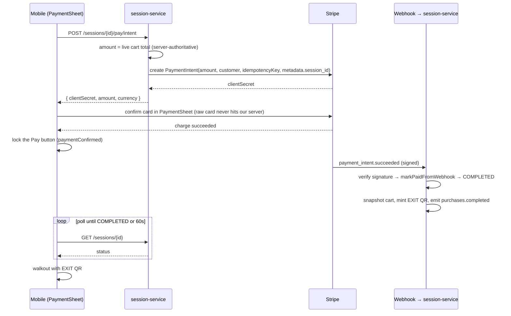
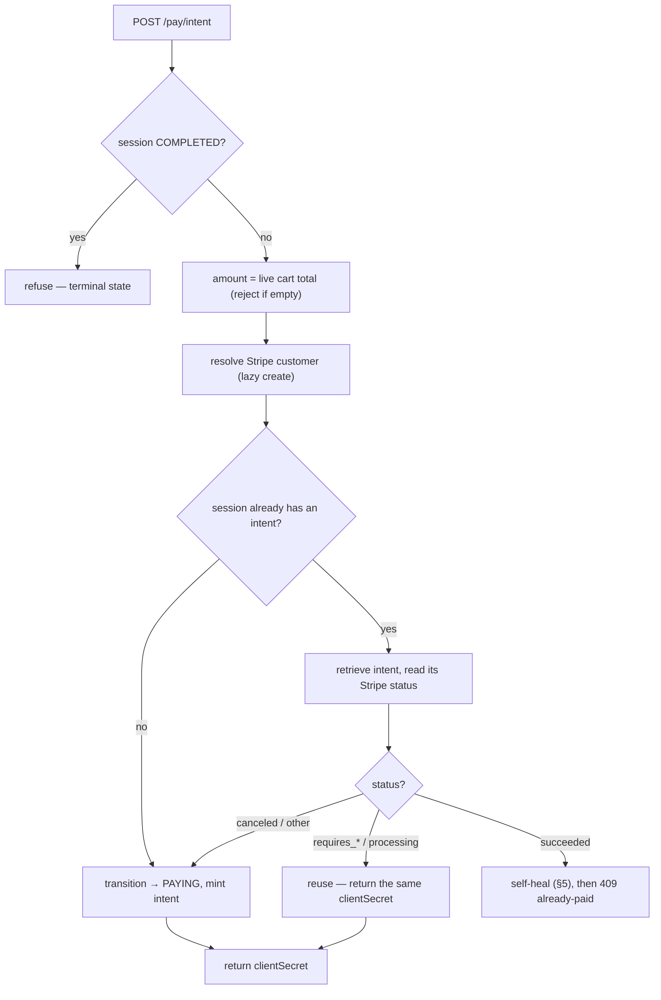

# 05 — Payments: Stripe end to end

Payments is where "never trust the client" stops being a slogan and starts
deciding the architecture. Everything in this flow is arranged around two facts:
the amount a shopper pays must be decided by the server, and the only thing we
trust to say "this was actually paid" is a cryptographically-signed webhook from
Stripe — never the phone. The rest of the design (intent reuse, the self-heal, the
double-charge lock) falls out of taking those two facts seriously.

This is the densest service in the system, so it's worth holding the shape in
your head first: the mobile asks the server to *create* a payment, confirms the
card *directly with Stripe*, and then *waits* for Stripe to tell the server it
cleared. Three parties, and our server is authoritative on amount and final state
but never touches a raw card number.

---

## 1. The three keys and the trust boundaries

Stripe gives you three secrets and they map onto three trust zones:

| Key | Form | Lives | Purpose |
|---|---|---|---|
| Publishable key | `pk_test_…` | mobile (`EXPO_PUBLIC_STRIPE_PUBLISHABLE_KEY`) | lets the app talk to Stripe to confirm a card |
| Secret key | `sk_test_…` | server, from Vault KV | authenticates our outbound Stripe API calls |
| Webhook secret | `whsec_…` | server, from Vault KV | verifies inbound webhooks really came from Stripe |

The publishable key is *meant* to be on the client; the other two are the crown
jewels and live only server-side, pulled from Vault's KV store at startup
([StripeProperties](atlassync-backend/session-service/src/main/java/com/atlassync/session/payment/StripeProperties.java),
seeded by `init-vault.sh`). The split is the PCI boundary: card details flow
phone → Stripe directly, never through our gateway or services, which keeps our
servers out of PCI scope.

---

## 2. The end-to-end flow

Notice the two arrows that *don't* exist: the mobile never sends an amount, and
the mobile never tells the server "I paid." The amount is computed on the server
and the COMPLETED transition is driven by the webhook. Everything else is
plumbing around those two omissions.

---

## 3. Server-authoritative amount + PaymentSheet

[createPaymentIntent](atlassync-backend/session-service/src/main/java/com/atlassync/session/service/SessionService.java#L111)
computes the amount from the **live cart** — `cartSnapshotClient.fetch(sessionId).total()`
— and refuses an empty cart. The client's role is to *display* a number, not to
*set* one; a tampered phone can't pay 1 MAD for a 200 MAD basket because the phone
never gets a vote on the amount. The intent stamps `session_id` into Stripe
metadata ([StripeService.java:84](atlassync-backend/session-service/src/main/java/com/atlassync/session/payment/StripeService.java#L84))
so the webhook can route the event back to the right session without trusting
anything the client said.

What comes back to the mobile is a `clientSecret`
([PaymentIntentResponse](atlassync-backend/session-service/src/main/java/com/atlassync/session/dto/PaymentIntentResponse.java)),
which the Stripe React Native SDK uses to present its PaymentSheet and confirm the
card **directly against Stripe**. Raw card details never hit our servers — that's
the entire reason for the client-secret handshake instead of proxying card data.
Amounts go to Stripe in the smallest currency unit (centimes for MAD), via a
`BigDecimal.movePointRight(2)` conversion so there's no floating-point money math.

---

## 4. Intent reuse and the `@Version` idempotency key

A shopper can land on the pay screen, background the app, come back, and tap pay
again. Without care that's two PaymentIntents — two potential charges. So before
minting anything, `createPaymentIntent` checks whether the session already has an
intent and, if so, retrieves it and branches on its Stripe status:

When it does mint, the Stripe call carries an **idempotency key** of
`session-{id}-v{version}`
([SessionService.java:196](atlassync-backend/session-service/src/main/java/com/atlassync/session/service/SessionService.java#L196)),
where `version` is the session's JPA `@Version`. This is the neat part: the
`@Version` that already exists for optimistic locking (doc 04) doubles as the
idempotency scope. Two requests racing to create an intent read the *same* version,
build the *same* key, and Stripe collapses them into a single PaymentIntent
instead of two. Once the session advances and the version bumps, a genuinely new
attempt gets a new key. One field, two jobs: concurrency guard and idempotency
window.

---

## 5. The self-heal — `REQUIRES_NEW` and a self-injected proxy

There's a race worth its own section because it's the cleverest code in the
service. Suppose the card clears at Stripe but the `payment_intent.succeeded`
webhook is slow. Meanwhile the user (or a retry) calls `pay/intent` again. The
reuse path retrieves the existing intent and finds it already `succeeded` — the
money is in, but our session is still `PAYING`. We can't just return a
clientSecret for an intent that's already done.

So [the succeeded branch](atlassync-backend/session-service/src/main/java/com/atlassync/session/service/SessionService.java#L164)
**self-heals**: it marks the session paid right now (doing the work the late
webhook would have done — transition to COMPLETED, snapshot the cart, mint the
exit QR, emit `purchases.completed`), then throws `SessionAlreadyPaidException`
(mapped to a `409`) so the client knows to stop and move on.

The subtlety is transactional. The method is about to throw, which rolls back its
transaction — so if `markPaidFromWebhook` ran in that same transaction, the
self-heal writes would roll back too and be lost. The fix
([selfHealMarkPaid](atlassync-backend/session-service/src/main/java/com/atlassync/session/service/SessionService.java#L305))
runs the heal in a **`REQUIRES_NEW`** transaction so it commits independently
before the outer rollback. And because Spring's `@Transactional` only applies
through the proxy, it has to be called as `self.selfHealMarkPaid(...)` via a
**self-injected** reference
([setSelf](atlassync-backend/session-service/src/main/java/com/atlassync/session/service/SessionService.java#L63))
— a plain `this.selfHealMarkPaid(...)` would bypass the proxy and the
`REQUIRES_NEW` would silently do nothing. This was a real fix (`af763f1 fix
self-heal rollback with requires new`); it's the kind of Spring-transaction gotcha
that's invisible until you test the exact race.

---

## 6. The webhook — the source of truth

[StripeWebhookController](atlassync-backend/session-service/src/main/java/com/atlassync/session/payment/StripeWebhookController.java)
is the only place a session legitimately becomes `COMPLETED`, and it's an open
path at the gateway because Stripe doesn't carry our JWT. Trust comes entirely
from the signature: every payload is run through
[constructEvent](atlassync-backend/session-service/src/main/java/com/atlassync/session/payment/StripeService.java#L129),
which verifies the `Stripe-Signature` header against the webhook secret. A bad
signature is a `400` and goes no further — there is deliberately no
"trust-unsigned" fallback.

Two robustness details earn their keep here:

**API-version skew.** Stripe's event schema can be newer than the `stripe-java`
SDK compiled into our service, and the strict deserializer refuses what it doesn't
recognize. So [unwrap](atlassync-backend/session-service/src/main/java/com/atlassync/session/payment/StripeWebhookController.java#L190)
falls back to `deserializeUnsafe()`, which maps the fields we actually care about
even across a version gap (`37ce3e4 deserialize webhooks across api versions`).
Without this, a Stripe-side API bump could quietly break payment completion.

**Retry semantics.** The handler chooses its HTTP status to *control* Stripe's
retries (`e1af1fc split webhook catches to stop retry storms`):

| Outcome | Status | Effect |
|---|---|---|
| Handled fine | 200 | Stripe stops |
| Illegal state (e.g. session `CANCELLED`) | 200 | ack — retrying will never make the move legal |
| Missing/bad metadata | 200 | ack — unrecoverable, don't retry forever |
| Transient failure (DB blip) | 500 | invite a retry — `markPaidFromWebhook` is idempotent |

That last row only works because `markPaidFromWebhook` no-ops when the session is
already `COMPLETED` (doc 04). Idempotency is what makes "return 500 and let Stripe
retry" safe.

---

## 7. Refunds, disputes, chargebacks

Money keeps moving after walkout, and the post-`COMPLETED` states from doc 04 are
how the session tracks it. Refunds are **admin-initiated, webhook-confirmed**:

- [RefundController](atlassync-backend/session-service/src/main/java/com/atlassync/session/payment/RefundController.java)
  exposes `POST /sessions/{id}/refund`, authorized by the gateway-forwarded
  `X-User-Role` (only `ROLE_ADMIN`/`ROLE_STAFF`; everyone else gets `403`). It
  bypasses the user-ownership check because an admin refunds on anyone's behalf.
- [issueRefund](atlassync-backend/session-service/src/main/java/com/atlassync/session/service/SessionService.java#L365)
  calls Stripe with its own idempotency key (`refund-{session}-{amount}-{reason}`,
  from `d56908a make refunds idempotent`) so a double-tapped refund doesn't refund
  twice.
- The *state change* doesn't happen in the endpoint — it happens when the
  `charge.refunded` webhook lands and
  [markRefundedFromWebhook](atlassync-backend/session-service/src/main/java/com/atlassync/session/service/SessionService.java#L311)
  picks `REFUNDED` vs `PARTIAL_REFUND` by comparing refunded amount to the
  original. Same pattern as payment: the endpoint *requests*, the webhook *confirms*.

Disputes follow the same shape: `charge.dispute.created` → `DISPUTED`,
`charge.dispute.closed` → `COMPLETED` if we won or `CHARGEBACK_LOST` if we lost
([resolveDisputeFromWebhook](atlassync-backend/session-service/src/main/java/com/atlassync/session/service/SessionService.java#L348)).
The session ends up reflecting the true financial outcome, set entirely by signed
events rather than anything a client claimed.

---

## 8. Lazy Stripe customers

[StripeCustomerService](atlassync-backend/session-service/src/main/java/com/atlassync/session/payment/StripeCustomerService.java)
creates a Stripe Customer the **first time a user checks out**, not at signup, and
caches the `cus_…` id in a `payment_customers` row keyed by `userId`. Every later
PaymentIntent attaches to the same Customer, which is what makes saved cards,
dashboard history, and refund/dispute correlation work. The reasoning is
deliberate: registration shouldn't depend on Stripe being reachable, and users who
never buy anything shouldn't clutter the Stripe dashboard. (There's a small
checked-to-unchecked exception dance inside `getOrCreate` so a `StripeException`
can escape an `orElseGet` lambda — ugly but commented; it's a Java-lambda
constraint, not a design choice.)

---

## 9. The tax mismatch — resolve this before you're asked

Here's the one genuine correctness bug in the payment path, and it's better to
volunteer it than get caught. The mobile review screen displays a
`Tax (8.75%)` line and a "YOU PAY" total of `subtotal + tax`
([review.tsx:15](atlassync-mobile/app/shop/review.tsx#L15)) — but the server
creates the PaymentIntent for the **cart subtotal only**, with no tax. So the
number the shopper sees and the number actually charged differ.

The git history tells the whole story. `0e3ab0e enable stripe automatic tax` added
`automatic_tax: enabled` to the intent plus a customer address (Stripe Tax needs
one to compute). Then `5753aad drop stripe automatic tax for now` removed both —
because Stripe Tax has to be registered for a jurisdiction and that isn't set up
for a Morocco demo. What got left behind is the client-side 8.75% line, which was
presumably meant to be replaced by Stripe's computed tax and never was (and 8.75%
is a US-style sales-tax rate anyway, not a Moroccan one). For a demo it's cosmetic,
but it *is* a real discrepancy between displayed and charged amounts; the honest
framing is "tax was going to be Stripe-computed, that path was shelved, and the
placeholder UI outlived it." The fix is either to drop the tax line or to charge
tax server-side and feed the same number to both the intent and the display.

---

## 10. The mobile client — confirm, lock, poll

The client half lives in [review.tsx](atlassync-mobile/app/shop/review.tsx) and is
careful in exactly the places a payment screen has to be. After `createPaymentIntent`
and `presentPaymentSheet`, the moment the card clears it sets
`paymentConfirmed = true` and **locks the Pay button**
([review.tsx:80](atlassync-mobile/app/shop/review.tsx#L80)) — so a slow webhook
can't tempt a re-tap into a second charge. Then it
[polls the session](atlassync-mobile/src/lib/waitForSessionStatus.ts) every second
(up to 60s) until the webhook flips it to `COMPLETED`, at which point the exit QR
is in hand and it routes to walkout. If the poll times out *after* the charge
cleared, it shows "Payment received — we're finalizing your trip" and crucially
**does not re-enable Pay**: the money is in, the session will complete in the
background, and the worst case is the shopper checks Orders in a moment rather than
double-paying. `StripeProvider` is configured once at the app root
([app/_layout.tsx:36](atlassync-mobile/app/_layout.tsx#L36)) with the publishable
key and an Apple-Pay merchant id.

---

## 11. Failure modes

| Situation | What happens | Why it's safe |
|---|---|---|
| Client tampers with displayed amount | ignored — server charges the live cart total | the client never sets the amount |
| User double-taps pay before webhook | reuse path returns the same intent; Pay button locks after charge | one PaymentIntent, no second charge |
| Card clears but webhook is late | self-heal completes the session in a `REQUIRES_NEW` tx, returns 409 | money-in state is committed, not lost to rollback |
| Webhook re-delivered | `markPaidFromWebhook` no-ops on `COMPLETED` | idempotent |
| Forged/unsigned webhook | `constructEvent` → 400 | no trust without a valid signature |
| Stripe event schema newer than SDK | `deserializeUnsafe` maps the fields we need | API skew can't break completion |
| Transient DB error in webhook | 500 → Stripe retries | retry is safe because the handler is idempotent |
| Double-tapped refund | same Stripe idempotency key | refunds once |
| Vault (Stripe secrets) down at boot | app starts; Stripe calls fail loudly | `fail-fast: false`; non-payment flows still work |

---

*Previous: [04 — Session lifecycle](04-session-lifecycle.md) · Next: [06 — Big Data: the medallion lakehouse](06-big-data-pipeline.md).*
