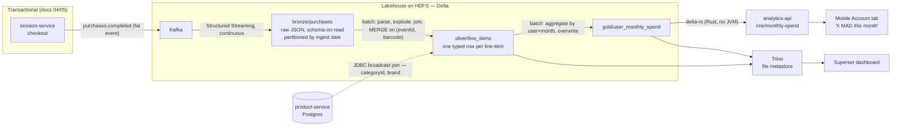
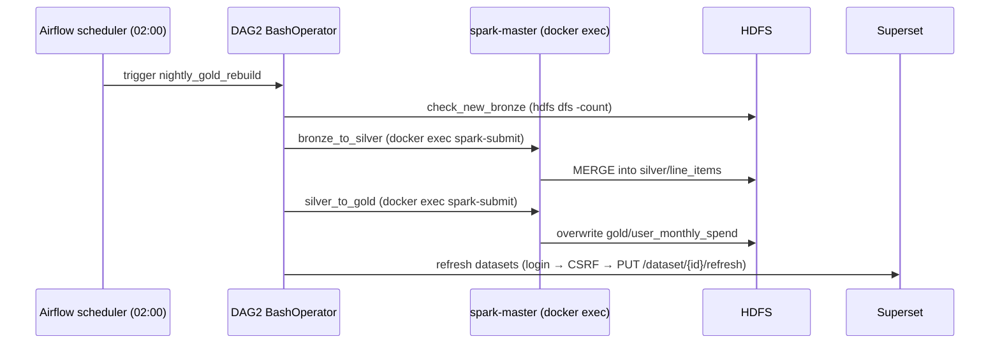

# 06 — Big Data: the medallion lakehouse

Every checkout produces one clean, structured fact: who bought what, for how much,
when. The Big Data pipeline's whole job is to turn that stream of facts into
analytics — a shopper's "spent this month" stat and an operator's revenue
dashboard — **without ever touching the transactional path**. Nothing in the
scan-walk-pay loop waits on Spark, HDFS, or Trino; the pipeline hangs entirely off
a single Kafka event and runs on its own time.

The shape is the **medallion architecture**: raw events land in *bronze*, get
typed and enriched into *silver*, and get aggregated into *gold*, with each tier a
Delta table on HDFS. This doc walks that path end to end, then the two ways the
gold/silver tables get served (a Python API and Trino+Superset), and the real
systems lessons hit along the way — the Spark cores starvation, the Airflow
`docker exec` pattern, and the Trino traps. The honest record for all of this is
the closed `big-data` issues on the backend repo; this doc is the distilled
version.

---

## 1. The fat event — one self-contained fact

The pipeline consumes exactly one topic: `purchases.completed`, emitted by
session-service the moment a session completes
([SessionEventProducer.java:44](atlassync-backend/session-service/src/main/java/com/atlassync/session/service/SessionEventProducer.java#L44)).
It's deliberately **fat** — `eventId`, `eventTime`, `sessionId`, `userId`,
`storeId`, `currency`, `total`, and the full `items[]` array — so Spark can land it
in bronze without a join back to any database. It's built from the *frozen*
`SessionLineItem` snapshot (doc 04), not a live cart read, so the event is
internally consistent with the receipt.

One field is deliberately absent: per-item `categoryId`. Including it would force
session-service to call product-service on the payment-completion critical path
(slow, and a hard coupling). So the event stays decoupled and the category JOIN is
pushed downstream into the silver job (which already has Spark and a JDBC
connection handy). This is the single most-defensible "why" in the pipeline:
**the coupling cost lives in the batch layer, not on the webhook.** (The thin
`session.paid` / `session.completed` events still fire too, for operational
consumers — they carry no analytics payload.)

---

## 2. The medallion, end to end

The three tiers each have a single job and a different correctness model:

| Tier | Job | Write mode | Why |
|---|---|---|---|
| **bronze** | land raw events verbatim | streaming append | never lose or reshape an event; survive any producer change |
| **silver** | type, explode, enrich | batch **MERGE** | one row per line-item; idempotent reruns |
| **gold** | aggregate to serving shape | batch **overwrite** | fully derived from silver; cheap to rebuild |

---

## 3. Bronze — schema-on-read landing

[stream_purchases_to_bronze.py](atlassync-backend/analytics/spark/jobs/stream_purchases_to_bronze.py)
is a Spark Structured Streaming job: read Kafka, write Delta, forever. It stores
the **raw JSON value as a string** alongside the Kafka envelope (topic, partition,
offset, timestamp) and partitions by ingest date. The point of keeping it
schema-on-read is resilience: a producer that adds or renames a field can never
break ingestion, because bronze doesn't parse anything — type enforcement is
silver's problem. Bronze is the "we have the raw truth, no matter what" layer.

Two operational properties make it production-shaped. A **checkpoint** on HDFS
(`checkpoints/bronze-purchases`) makes the job restart-safe: stop and restart the
container and it resumes from the last committed Kafka offset, no duplicates and no
gaps. And `failOnDataLoss=false` keeps it running across topic retention edges in
dev rather than dying. One subtlety worth knowing: bronze partitions by
`current_date()` (when the event was *ingested*), while silver re-partitions by the
event's own `eventTime`. That distinction is what lets the seeder (§9) replay 60
days of historical events — they all land in today's bronze partition but get
bucketed into their true dates in silver.

---

## 4. Silver — typed, exploded, enriched, idempotent

[bronze_to_silver_line_items.py](atlassync-backend/analytics/spark/jobs/bronze_to_silver_line_items.py)
is a batch job that does four things: parse `payload_json` against an explicit
schema, **explode** the `items[]` array into one row per line-item, **broadcast-join**
against product-service Postgres over JDBC for `categoryId` + `brand`, and write
the result to silver. The broadcast join is the right call because the products
table is small enough to ship to every Spark worker, avoiding a shuffle.

The correctness mechanism here is the **MERGE on `(eventId, barcode)`**
([line 139](atlassync-backend/analytics/spark/jobs/bronze_to_silver_line_items.py#L139)):
re-running the job over the same bronze data updates matching rows in place instead
of appending duplicates. That's what makes the nightly rebuild safe to run again
after a failure — silver is idempotent against reprocessing. The product JOIN is a
**left** join, so a barcode that isn't in product-service (an OFF-imported product
whose `categoryId` the enricher never set — doc 02) keeps its line with null
category/brand rather than vanishing. That's also why the gold cross-check in the
closed issues showed some null categories: it's the left-join behaving correctly,
not a bug.

---

## 5. Gold — the serving aggregate

[silver_to_gold_monthly_spend.py](atlassync-backend/analytics/spark/jobs/silver_to_gold_monthly_spend.py)
aggregates silver by `(userId, yearMonth, currency)` into `totalSpend`,
`tripCount` (distinct sessions), and `avgTrip`, and writes with
**`.mode("overwrite")`**. Gold uses overwrite, not MERGE, on purpose: it's fully
derived from silver and its cardinality is tiny (users × months), so the simplest
correct thing — throw it away and rebuild — beats any merge logic to maintain.
This is the table the mobile "spent this month" stat reads, so its shape is driven
by what the Account tab needs, not by what's convenient to compute.

---

## 6. The Spark cores story — a real systems lesson

This one is worth telling because it's the kind of thing you only learn by running
it. Spark Standalone gives **each application all available cores by default**.
With a single-core worker, the always-on streaming job grabbed the one core and the
nightly batch job sat in `WAITING` forever — the pipeline deadlocked on itself. The
fix was two lines in `docker-compose.yml`: bump the worker to 2 cores
(`SPARK_WORKER_CORES: 2`) and cap each app's default share at 1
(`SPARK_MASTER_OPTS=-Dspark.deploy.defaultCores=1`), so streaming and batch can
coexist. There's a second Spark gotcha baked into every submit command: the
`apache/spark` image runs as a user with `HOME=/nonexistent`, so Ivy (which
resolves `--packages` jars) needs `--conf spark.jars.ivy=/tmp/.ivy2` or it fails
trying to write to a home directory that isn't there.

---

## 7. Orchestration — Airflow via `docker exec`

Two DAGs run the pipeline.

**DAG 1, `streaming_setup`** ([streaming_setup.py](atlassync-backend/analytics/airflow/dags/streaming_setup.py)) —
manual trigger, run once after the stack comes up:
`kafka_check → producer_check → start_spark_streaming_job`. It's honest in its own
docstring that it's **not idempotent**: re-triggering launches a *second* streaming
driver alongside the first (fine in dev, where you kill one from the Spark UI; in
prod the first task would be a "streaming-already-up" sensor).

**DAG 2, `nightly_gold_rebuild`** ([nightly_gold_rebuild.py](atlassync-backend/analytics/airflow/dags/nightly_gold_rebuild.py)) —
scheduled `0 2 * * *`:
`check_new_bronze → bronze_to_silver → silver_to_gold → refresh_superset_dashboard`.

The architectural choice worth defending: tasks are `BashOperator`s that
**`docker exec` into the spark-master / kafka / hadoop containers** through a
mounted host `docker.sock`, rather than installing the Spark provider and using
`SparkSubmitOperator`. The upside is fewer moving parts and an *exact* match to the
commands you'd run by hand. The costs are real and worth naming: the DAGs hardcode
compose-v1 container names (`atlassync-backend_spark-master_1`), so they're coupled
to the compose project name and v1 naming; and mounting `docker.sock` gives the
Airflow container control of the host Docker daemon, which is a privilege you'd
never grant so casually in production. The Airflow image is also custom-built
([Dockerfile](atlassync-backend/analytics/airflow/Dockerfile)) to add the official
`docker-ce-cli` (Debian's `docker.io` ships a client too old for the host daemon's
API) and a `hostdocker` group matching the host's docker GID so the airflow user
can actually read the socket.

---

## 8. Serving — two readers over the same Delta tables

The gold and silver tables are read two completely different ways, which is a nice
illustration of "the data layer is shared, the access patterns aren't."

**analytics-api (the app path).**
[analytics-api/main.py](atlassync-backend/analytics-api/main.py) is a small FastAPI
service that reads gold via the `deltalake` Python library and serves
`GET /api/analytics/me/monthly-spend`. The notable engineering detail: `deltalake`
reads `hdfs://...` **natively over a bundled Rust crate** — no libhdfs, no JNI, no
JDK in the container — so the image is just Python-slim plus a few wheels. That's
the whole reason this service is Python and not another Spring app (doc 00). It
reads `X-User-Id`, returns the current month plus five months of history, and
degrades gracefully: a missing gold table (`TableNotFoundError`) returns a
zeros-shaped response rather than a 500, so the mobile never breaks if HDFS is
wiped in dev. The mobile [Account tab](atlassync-mobile/app/(tabs)/account.tsx#L181)
reads this and renders `totalSpend` as its hero "X MAD this month" stat.

**Trino + Superset (the BI path).** Trino is the SQL engine over Delta on HDFS, and
Superset queries through it. The configuration choice that matters is the
[Trino catalog](atlassync-backend/analytics/trino/etc/catalog/delta.properties):
`connector.name=delta_lake` with **`hive.metastore=file`** — a file-based metastore,
no Hive Metastore service to run. (The full "why no Hive" decision, against the
other lakehouse options, is doc 08; here it's enough that Trino reads Delta without
a metastore server.) Two traps were paid for along the way and are worth carrying:
the native HDFS filesystem flag is `fs.hadoop.enabled`, **not** the older
`fs.native-hdfs.enabled`; and registering an existing Delta table needs
`delta.register-table-procedure.enabled=true` because the `register_table`
procedure is gated by default in current Trino. Superset's dashboard ("AtlasSync —
Overview") has four charts — total revenue this month (big number, from gold),
revenue by day and active shoppers per day (lines, from silver), and top-10
products (bar, from silver) — bootstrapped idempotently by a script, with a 5-minute
auto-refresh. The last Trino trap: it **lowercase-folds Delta column names**, so
Spark's `totalSpend` is `totalspend` in SQL Lab — invisible until a hand-written
query fails.

---

## 9. The end-to-end trace, the seeder, and an honesty note

Putting it together, a single purchase becomes a stat like this:

> checkout → `purchases.completed` on Kafka → Structured Streaming lands it in
> bronze → nightly DAG2 runs bronze→silver (explode + product JOIN, MERGE) and
> silver→gold (aggregate, overwrite) → analytics-api reads gold over delta-rs →
> the Account tab shows "X MAD this month"; Superset renders the same data via
> Trino.

Two things keep this honest. First, the **seeder**
([seed_fake_purchases.py](atlassync-backend/analytics/scripts/seed_fake_purchases.py)).
A demo with one real purchase makes a sad dashboard, so the seeder generates
hundreds of synthetic `purchases.completed` events — using *real* product
barcodes/names/prices pulled from product-service Postgres, spread across weighted
users, cart sizes, and times-of-day for texture — and pipes them to
`kafka-console-producer`. The important part: it replays through the **same
pipeline** (Kafka → bronze → DAG2 → silver → gold), not a shortcut that writes gold
directly. So the seeded dashboard is proof the whole medallion path works at
volume, not a faked screenshot.

Second, the closed-issue record is candid about a real gap: when gold was first
built, only 1 of 4 historical sessions in Postgres showed up, because the other 3
predated the `purchases.completed` emitter and never went through Kafka. Rather
than backfill quietly, the issue documents the discrepancy and explains it. That's
the right instinct for a pipeline — reconcile against the source of truth and say
out loud when they differ.

---

## 10. Failure modes & operational notes

| Situation | What happens | Why it's acceptable |
|---|---|---|
| Producer adds/renames a field | bronze stores it raw; silver ignores unknowns | schema-on-read bronze can't break on producer change |
| Streaming job restarted | resumes from checkpointed Kafka offset | no dup, no gap |
| Nightly job re-run after failure | silver MERGE + gold overwrite are idempotent | safe to retry the whole DAG |
| Barcode missing in product DB | silver row kept with null category/brand (left join) | analytics survives an unmatched product |
| HDFS wiped / gold missing | analytics-api returns zeros, not 500 | mobile UI prefers a zero block over an error |
| DAG 1 re-triggered | a second streaming driver starts | dev-tolerable; prod needs an "already-up" sensor |
| Spark single-core contention | streaming starves batch | fixed: 2-core worker + `defaultCores=1` |
| Trino column-name SQL fails | columns are lowercase-folded | remember `totalspend`, not `totalSpend` |

---

*Previous: [05 — Payments: Stripe](05-payments-stripe.md) · Next: [07 — Mobile architecture](07-mobile-architecture.md).*
