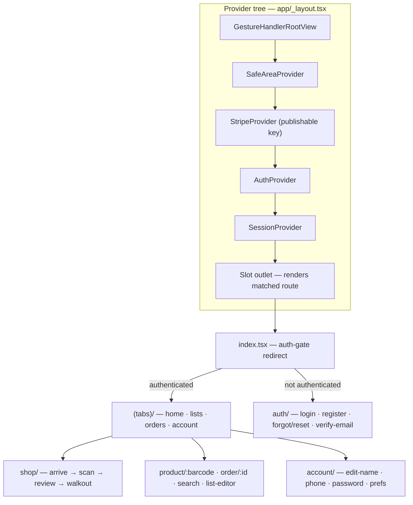
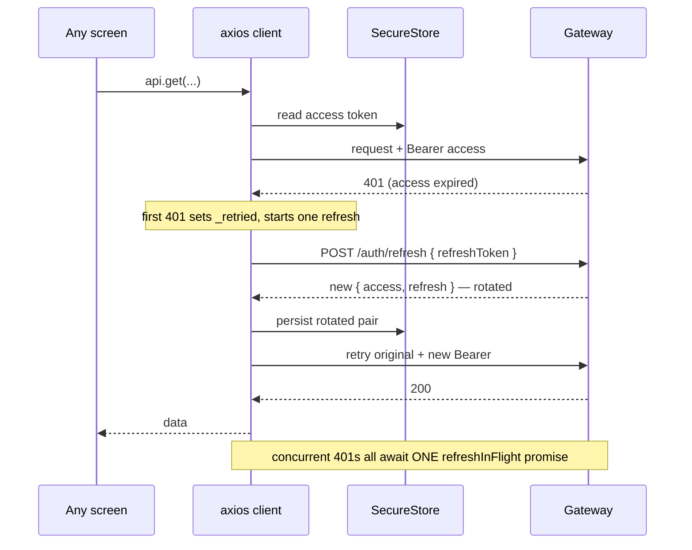

# 07 — Mobile architecture

The mobile app is a thin, **online-first** client over the gateway. Almost none of
its logic is business logic — the server owns pricing, totals, session state, and
payment truth (docs 02–05), so the app's job is to render what the server says,
capture input (a barcode, a card, a tap), and stay out of the way. That framing is
worth holding onto, because it explains nearly every architectural choice here:
the app is deliberately *small*, and the few genuinely interesting pieces are all
about talking to the backend cleanly.

The interesting engineering lives in four places: the routing + provider tree, the
axios auth interceptor, the LAN base-URL resolution that lets a real phone reach a
laptop, and the confirm-then-poll payment dance. Everything else is screens.

---

## 1. The stack, and what's deliberately absent

| Concern | Choice |
|---|---|
| Framework | Expo SDK ~54, React 19, React Native 0.81 |
| Routing | expo-router ~6 (file-based) |
| HTTP | axios ~1.15 with interceptors |
| Camera | expo-camera (barcode scanning) |
| Payments | @stripe/stripe-react-native (PaymentSheet) |
| Secure storage | expo-secure-store (keychain/keystore) |
| State | **React Context + screen-local state — nothing else** |

What's *absent* is the point. There's no Redux, no Zustand, no React Query /
TanStack Query, and no AsyncStorage. For an app this size — two pieces of truly
global state (who's logged in, what session is active) and a handful of screens
that each fetch their own data — a global store or a data-cache library would be
weight without payoff. State is owned where it's used: two contexts for the two
global things, `useState`/`useEffect` for everything screen-local. That's a
defensible "no over-engineering" call, and naming it as a *choice* (not an
omission) is the right posture if asked "why no Redux?"

---

## 2. Routing — expo-router, file as route

expo-router maps the `app/` directory straight onto the navigation tree: a file is
a route, a folder is a nested navigator, `[param]` is a dynamic segment, and
`(group)` is a layout group that doesn't add a path segment. The root
`_layout.tsx` holds the providers and an `<Slot />` outlet that renders whichever
route matched.

A few decisions to read off this. The entry route
[index.tsx](atlassync-mobile/app/index.tsx) is a pure **auth gate**: read
`isAuthenticated` from `AuthContext`, show a blank screen while it's loading from
storage, then declaratively `Redirect` to `/(tabs)/home` or `/auth/login`. The
`(tabs)` group is the bottom-tab shell for the four main destinations; the
scan-pay flow under `shop/` and the detail screens (`product/[barcode]`,
`order/[id]`) live *outside* that group so they push full-screen over the tabs.
And the tab bar itself is **hand-rolled** — [(tabs)/_layout.tsx](atlassync-mobile/app/(tabs)/_layout.tsx)
renders an `<Slot />` plus a custom `<TabBar>` whose active tab is derived from
`usePathname()`, rather than using the stock navigator's tab bar. That's a
design-fidelity choice: the bespoke visual treatment was easier to own than to
fight the default component into.

---

## 3. The provider tree and the two contexts

The nesting order in [app/_layout.tsx](atlassync-mobile/app/_layout.tsx#L33) is
deliberate: `GestureHandler → SafeArea → Stripe → Auth → Session → Slot`.
`AuthProvider` wraps `SessionProvider` because a shopping session belongs to a
user — session work can depend on auth, never the reverse. Fonts (Geist for sans,
Instrument Serif for the display type) gate the splash screen: the root returns
`null` until `useFonts` resolves, so nothing renders half-styled.

The two contexts split global state along its natural seam:

- **[AuthContext](atlassync-mobile/src/context/AuthContext.tsx)** owns the `user`
  object and `isAuthenticated`, exposes `login` / `register` / `logout`, and wires
  itself to the axios layer's unauthenticated handler so a failed refresh drops
  the app to logged-out. It persists the `AuthResponse` on every auth event and
  preserves the device-only avatar across re-auth.
- **[SessionContext](atlassync-mobile/src/context/SessionContext.tsx)** owns the
  live shopping session — `sessionId`, `entryQr`, `exitQr`, `cart` — and the shop
  actions (`startSession`, `scanItem`, `removeItem`, `validateExit`, `cancel`).
  Screens never touch the cart API directly; they go through this context, which
  re-fetches the authoritative snapshot after each mutation (doc 03).

Everything else — a product detail, an order receipt, this month's spend — is
local to the screen that needs it. There's no global cache because there's nothing
that two distant screens both need to keep in sync.

---

## 4. The axios auth interceptor — the one piece of real cleverness

[client.ts](atlassync-mobile/src/api/client.ts) is where the app earns its
"online client" stripes. A request interceptor attaches the access token; a
response interceptor handles the 401 → refresh → retry cycle so screens never see
an expired token. The subtle part is that the refresh is **single-flight**.

The `refreshInFlight` promise is the key detail. When a screen mounts and fires
five requests at once and they all 401 on an expired token, a naive interceptor
fires five refreshes — which race each other against the backend's refresh-token
**rotation**, and the second one to land presents an already-rotated token and
trips the server's reuse-detection, nuking the whole family (doc 01). By funnelling
every concurrent 401 through a single shared `refreshInFlight` promise, exactly one
refresh happens and the rest await its result. The `_retried` flag on each request
prevents an infinite refresh loop. If the refresh itself fails, the interceptor
clears storage and calls the unauthenticated handler, which flips `AuthContext` to
logged-out and the index gate bounces the user to login. This is the client-side
mirror of the server's rotation design, and the two have to agree or sessions die
mysteriously.

---

## 5. Secure storage — keychain, not AsyncStorage

[storage.ts](atlassync-mobile/src/api/storage.ts) keeps the access token, refresh
token, and user object in **expo-secure-store**, which is the OS keychain
(iOS) / keystore (Android) — encrypted at rest, not the plaintext key-value of
AsyncStorage. For credentials that's the correct call, and the app leans into it
hard enough that even the recent-search history uses SecureStore rather than pull
in AsyncStorage as a second storage dependency for "eight short strings"
([recentSearches.ts](atlassync-mobile/src/lib/recentSearches.ts)).

Two details worth noting. `getUser` does **forward-compatible deserialization** —
a user object stored before preferences existed gets `EMPTY_PREFERENCES` filled in
on read, so an app update doesn't crash on an old stored session. And the avatar is
explicitly a **device-only** local file URI: the backend doesn't own avatars yet,
so `AuthContext` carries it across re-auth rather than letting a fresh server user
object blow it away. That's a small but honest seam — one piece of "user state"
lives only on the phone.

---

## 6. LAN base-URL resolution — how a real phone finds the laptop

This is the trick that makes on-device testing painless, and it matters because the
two things that *require* a physical device — the camera and Stripe's PaymentSheet
— can't be tested on a simulator alone. [constants/api.ts](atlassync-mobile/src/constants/api.ts#L14)
resolves the gateway URL in three tiers:

1. `EXPO_PUBLIC_API_BASE_URL` if set — explicit override for staging or a real build.
2. Otherwise, `Constants.expoConfig.hostUri` — in Expo dev this exposes the **LAN
   IP the laptop's Metro bundler is bound to**, so the app computes
   `http://<laptop-ip>:8080` and a real phone on the same Wi-Fi reaches the gateway
   with zero hardcoding.
3. `localhost:8080` as a last resort — only useful for the iOS simulator on the
   same machine.

The win is that you never edit a hardcoded IP when your DHCP lease changes or you
move networks — the app discovers where the gateway is from Expo's own dev server.
The same `hostUri` derives the (currently unused) WebSocket URL too.

---

## 7. The confirm-then-poll payment pattern

The one place the client does something genuinely subtle is checkout, and it's a
direct consequence of "the webhook is the source of truth" (doc 05). The app does
**not** trust its own `presentPaymentSheet` success to mean "paid." Instead, after
Stripe confirms the card, [review.tsx](atlassync-mobile/app/shop/review.tsx) locks
the Pay button (`paymentConfirmed`, so a slow webhook can't tempt a double-charging
re-tap) and then **polls** the session via
[waitForSessionStatus](atlassync-mobile/src/lib/waitForSessionStatus.ts) — `GET
/sessions/{id}` once a second, up to 60s — until the server's webhook flips it to
`COMPLETED`. Only then is the exit QR in hand and the app routes to walkout. If the
poll times out *after* the charge cleared, it shows "Payment received — finalizing"
and pointedly does not re-enable Pay. The client is architected to treat the
server's asynchronous truth as authoritative over its own synchronous success — a
small amount of polling code buying a lot of correctness.

---

## 8. Offline tolerance — what survives, and what deliberately doesn't

The honest answer: the app is **online-first by design**, and that's a decision,
not a gap. There is no AsyncStorage cache, no `NetInfo`, no offline queue, no
cached catalog.

| Works offline | Requires the gateway |
|---|---|
| Staying logged in (tokens in SecureStore) | Scanning / cart (gRPC + Redis behind the gateway) |
| Recent search history | Product lookups & search |
| | Starting / paying / exiting a session |
| | "Spent this month" and order history |

Why is that right rather than lazy? Because AtlasSync is an *in-store* app whose
entire premise is server-authoritative — live cart, server-computed totals,
webhook-driven payment, signed gate QRs. An offline cart would have to invent local
pricing and a reconciliation story that fights the whole design (doc 03's
"the server snapshot is the truth"). The shopper is, by definition, standing in a
store on a network. So the app tolerates offline exactly where it's cheap and
safe — your login and your recent searches — and hard-fails everywhere a stale
local guess could cause a wrong charge. Worth stating plainly as a deliberate
boundary if a reviewer asks "what happens with no signal?"

---

## 9. The data-fetching pattern

With no React Query, screens fetch in a `useEffect` with a `cancelled` guard,
store the result in `useState`, and render a placeholder (`—`) until it arrives —
the Account tab pulling `analyticsApi.monthlySpend()` and `sessionsApi.history()`
on mount is the canonical example. There's no client-side cache or background
refetch; each screen owns its fetch and its loading state. For an app where most
data is either cheap to re-fetch or pushed through `SessionContext` after a
mutation, that's enough. The cost is no automatic dedup or staleness handling
across screens — which is the tradeoff you accept for not carrying a data-layer
library — and it's the natural place React Query would slot in if the app grew a
lot more shared, frequently-refetched data.

---

*Previous: [06 — Big Data pipeline](06-big-data-pipeline.md) · Next: [08 — Infrastructure & observability](08-infrastructure-observability.md).*
