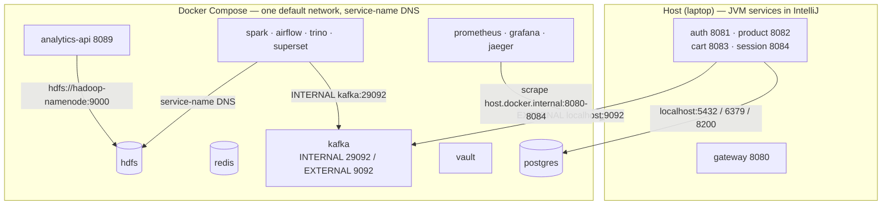
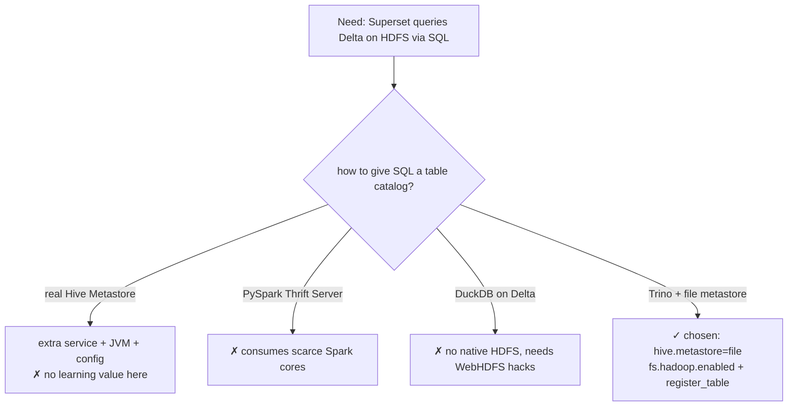

# 08 — Infrastructure & observability

This closes the set by stepping back from any one service to the substrate they
all run on: the docker-compose layout, the host/container hybrid that shapes the
whole dev experience, the networking that bridges those two worlds, Vault's two
jobs, the data-store topology, the lakehouse infra decisions (including the
"why no Hive metastore" answer deferred from doc 06), the volume bugs that were
actually hit, and the honest state of observability. The theme throughout: this is
a *learning* deployment, and the interesting parts are the seams where a
laptop-scale setup meets production-shaped patterns — and where it knowingly
doesn't.

---

## 1. The host/container hybrid

The single most important infra fact in AtlasSync: **the five Spring services run
on the host, everything else runs in Docker.** `gateway`, `auth`, `product`,
`cart`, and `session` are launched from IntelliJ on ports 8080–8084; Postgres,
Redis, Kafka, Vault, the entire lakehouse, the Python `analytics-api`, and the
observability stack live in `docker-compose.yml`.

Why split it this way? Developer ergonomics. The Spring services are the code you
actually edit, so running them in the IDE buys hot-reload, breakpoints, and instant
restarts; the infrastructure is just dependencies you stand up once and forget. The
cost is a recurring trap worth internalizing: because the running service is a JAR
in IntelliJ and *not* in compose, "my config change isn't taking effect" almost
always means the old process is still running — several closed issues note "restart
the service in IntelliJ" as the missing step. The other cost is that the host and
the container network now have to reach each other, which is its own section.

---

## 2. The networking bridge

There's no explicit `networks:` block in the compose file, so every container sits
on the default compose network and reaches every other container by **service
name** (`postgres`, `kafka`, `hadoop-namenode`). The host is a different story, and
three bridges make it work:

- **Host → containers: `localhost` + mapped ports.** The Spring services connect to
  `localhost:5432` (Postgres), `localhost:6379` (Redis), `localhost:8200` (Vault),
  because compose publishes those ports to the host.
- **Kafka's dual listeners.** Kafka is the awkward one, because both host *and*
  container clients talk to it, and they need different addresses. So it advertises
  two listeners (`dbe7450 split kafka listeners`): `EXTERNAL` as
  `localhost:9092` for the host-running Spring producers, and `INTERNAL` as
  `kafka:29092` for in-container consumers like the Spark streaming job. A client
  that used the wrong one would connect to the broker and then be handed an
  unreachable advertised address — the classic Kafka-in-Docker footgun, solved by
  advertising both.
- **Prometheus → host services.** Metrics scraping runs the other direction —
  Prometheus (in a container) has to reach Spring services (on the host) — so its
  service uses `extra_hosts: host.docker.internal:host-gateway` and the scrape
  config targets `host.docker.internal:8080–8084`.

If you remember one thing: **containers talk by name, the host talks by
`localhost`, and Kafka + Prometheus are the two places that have to cross the
boundary explicitly.**

---

## 3. Vault — two jobs, dev-mode honesty

Vault does two unrelated things for the system, through two different engines:

| Engine | Used by | For |
|---|---|---|
| `transit` | session-service `QrSigningService` (runtime, RestClient) | sign/verify gate QR tokens (ECDSA-P256), key never leaves Vault |
| `kv` | session-service spring-cloud-vault (startup) | store the Stripe `sk_`/`whsec_` secrets |

The `vault-init` sidecar enables the transit engine, creates the `qr-signing-key`,
and seeds the Stripe KV (when the env vars are present) on every `up`. The honest
caveat is dev-mode: **Vault here runs in-memory, so every `docker-compose down`
wipes the signing key and the secrets** (INFRA_COMMANDS.md says it outright). Two
mechanisms keep that from being fatal in dev: `QrSigningService` falls back to an
in-process HMAC when the transit key is gone (doc 04), and session-service sets
`fail-fast: false` so a missing KV secret doesn't stop the app from booting (doc
05). The production posture would be a non-dev Vault with persistent storage,
auto-unseal, and real auth instead of the `root` token — this setup gets the
*shape* of "secrets and signing live behind a boundary the app can't read" without
the operational weight.

---

## 4. Data-store topology — one Postgres, a DB per concern

There's a single Postgres container, and `init-databases.sql` carves it into
**seven logical databases** — but only four are alive:

| Database | Owner | Status |
|---|---|---|
| `atlassync_auth` | auth-service | live |
| `atlassync_product` | product-service | live |
| `atlassync_session` | session-service | live |
| `atlassync_cart` | cart-service | live |
| `atlassync_store` | (store-service) | empty stub |
| `atlassync_notification` | (notification-service) | empty stub |
| `atlassync_worker` | (worker-service) | empty stub |

One container, many databases, is the deliberate compromise: it gives each service
a real schema boundary — auth can't read session's tables — without running seven
separate Postgres containers on a laptop. Each live service owns its schema through
**Flyway migrations** with `ddl-auto: validate`, so the schema is migration-managed
and Hibernate refuses to start against a mismatched DB rather than silently
auto-creating tables. The three stub databases (and the aspirational Kafka topics
in INFRA_COMMANDS.md like `stock.alert`, `pricing.update.requested`,
`aisle.entered`) are the footprint of services that were planned but never built —
honest scaffolding, not dead weight, but worth naming as "not implemented" rather
than implying a store or IoT tier exists. Redis is the only other transactional
store, holding the cart and product caches, and it's intentionally ephemeral (docs
02–03).

---

## 5. The lakehouse infra — and why no Hive metastore

The analytics tier (doc 06) sits on HDFS (`bde2020/hadoop-*` images, WebHDFS on,
permissions off for dev, `fs.defaultFS = hdfs://hadoop-namenode:9000`). The
decision worth defending — deferred here from doc 06 — is how Superset gets a SQL
catalog over Delta tables on HDFS **without a Hive Metastore**:

Trino with a **file-based metastore** (`hive.metastore=file`) was the pick because
it gives Trino a catalog from a directory on disk — no metastore server to run, no
extra database, no extra JVM. The alternatives each lost on a concrete axis: a real
Hive Metastore is a whole extra stateful service whose only job here would be
holding table definitions Trino can hold itself; the PySpark Thrift Server would
compete for the same 2 worker cores the batch/streaming jobs already fight over
(doc 06's cores story); and DuckDB doesn't speak HDFS natively, so it'd need WebHDFS
gymnastics. Two configuration scars from getting Trino working: the native HDFS flag
is `fs.hadoop.enabled` (not the older `fs.native-hdfs.enabled`), and registering an
existing Delta table needs `delta.register-table-procedure.enabled=true` because
that procedure is gated by default. Trino runs single-node here (coordinator also
schedules work), capped at 2 GB heap.

---

## 6. Volume strategy — and the bind-mount bug

The compose file mixes bind mounts and named volumes on purpose, and getting it
wrong caused a real bug. The rule that emerged:

| Mount type | Used for | Why |
|---|---|---|
| **Bind mount** (`./path:/container`) | code & config — Spark jobs, Airflow DAGs, Trino config, init scripts | edit on the host, container picks it up live (hot-reload, no rebuild) |
| **Named volume** | state the container writes — Postgres/HDFS data, Airflow logs/plugins, Trino/Superset home | durable across `down`, and managed inside the container's own UID space |

The bug: Airflow's `logs` and `plugins` were first bind-mounted onto the host, and
Airflow's CLI broke — running as the host UID (1000), which has **no entry in
`/etc/passwd` inside the container**, the tooling fell over (issue #21). The fix was
to make logs/plugins **named volumes** so the container writes them in its own UID
space, while keeping the DAGs folder a **bind mount** so editing a DAG on the host
hot-reloads. That's the general principle in one line: *bind-mount what you edit,
named-volume what the container writes.* The persistent named volumes
(`postgres-data`, `hadoop-namenode-data`, `hadoop-datanode-data`, `trino-data`,
`superset-home`, the Airflow pair) are what let `docker-compose down` (without `-v`)
keep your data; `down -v` is the documented nuclear reset that re-runs every init
script from scratch.

---

## 7. docker-compose v1 papercuts

The stack runs on **docker-compose v1**, which is visible in the Airflow DAGs'
hardcoded `atlassync-backend_spark-master_1` container names (the `_1` suffix is v1
naming) and called out in several issue close-comments. v1 brings two frictions
worth knowing because they look like real bugs the first time:

- **`KeyError: ContainerConfig` on recreate.** A well-known compose-v1 bug: trying
  to recreate an existing container in place sometimes throws this from deep in the
  Python. The workaround is to remove the container and recreate it fresh
  (`docker-compose rm` then `up`, or the `down`/`up` cycle) rather than an in-place
  recreate — which is part of why INFRA_COMMANDS.md leans on full down/up cycles.
- **Streaming job killed by recreate.** The bronze streaming job runs as a
  `docker exec -d` process *inside* the spark-master container (doc 06), so anything
  that recreates that container — a compose change, an image pull — kills the
  running stream. It's not lost data, though: the HDFS checkpoint makes it
  restart-safe, so re-triggering Airflow DAG 1 resumes from the last committed
  Kafka offset. Knowing the streaming job's lifetime is tied to the container's is
  the point.

These aren't elegant, but they're honest dev-environment realities; the production
answer is compose v2 (which fixes the `ContainerConfig` bug and uses `-1` naming)
or a real orchestrator.

---

## 8. Observability — metrics real, tracing stubbed

This is the section to be most honest about, because the gap between what's running
and what's *working* is real.

**Metrics are genuinely wired.** Prometheus scrapes `/actuator/prometheus` on the
gateway and all four services (via `host.docker.internal`), so request rates,
latency histograms, and JVM memory are all queryable — INFRA_COMMANDS.md even lists
the PromQL. Grafana sits on top, though its data source and dashboards are still
set up by hand (no provisioned dashboard JSON yet).

**Tracing is provisioned but not emitting.** Jaeger is in the compose file with its
OTLP ports exposed (4317/4318), but **no Spring service has a tracing exporter
dependency** — there's no `micrometer-tracing`/OpenTelemetry on any classpath, and
INFRA_COMMANDS.md says it plainly: "Currently empty — services don't send traces
until Phase 3." So if the question is "show me a distributed trace of a scan
crossing gateway → cart → product → Redis," the honest answer is: the backend that
*would* produce it isn't wired up. The infrastructure is staged for it; the
instrumentation is the unbuilt half. `kafka-ui` (port 8090) rounds out the
operational tooling for eyeballing topic contents.

The one-line summary to give a reviewer: **observability is metrics-complete and
tracing-scaffolded** — don't claim the trace view works, do claim the metrics do.

---

## 9. Running the whole thing

Pulling the bring-up together (the short version; INFRA_COMMANDS.md is the full
reference):

1. `docker compose up -d` in `atlassync-backend/` starts Postgres, Redis, Kafka,
   Vault (+ the `vault-init` sidecar), HDFS, Spark, Airflow, Trino, Superset, the
   containerized `analytics-api`, and the observability stack.
2. Run the five Spring services from IntelliJ (ports 8080–8084) — they are **not**
   in compose. Flyway migrates and seeds each DB on first start.
3. `stripe listen --forward-to localhost:8080/api/sessions/webhooks/stripe` bridges
   Stripe test events to the gateway; feed the printed `whsec_` into the env.
4. `npx expo start` in `atlassync-mobile/`; a real phone on the same Wi-Fi finds the
   gateway via Expo's `hostUri` (doc 07).
5. `analytics/scripts/seed_fake_purchases.py | docker exec -i …kafka… kafka-console-producer`
   to give the lakehouse and dashboard volume (doc 06).
6. `docker-compose down -v` is the clean-slate reset — every database re-initializes
   from its init script and Flyway re-seeds on the next service start.

That's the whole machine: a host/container hybrid stitched together by `localhost`,
service-name DNS, and two carefully-advertised Kafka listeners, with secrets behind
Vault, analytics on a real lakehouse, metrics flowing and tracing waiting in the
wings. It's a learning deployment that earns most of the production patterns it
reaches for, and is honest about the few it only gestures at.

---

*Previous: [07 — Mobile architecture](07-mobile-architecture.md) · Back to [00 — System Overview](00-overview.md).*
